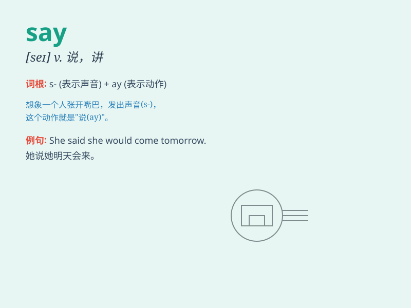

## say

**英音:** _[seɪ]_ **美音:** _[se]_

**译义:**
*v.说,讲,背诵,念,表示,比方说,假定n.话语,想说的意见,发言权*

### 短语

+ **say goodbye:** _道别；告别_

+ **say hello:** _打招呼；问好_

+ **say something:** _说点什么_

+ **have something to say:** _有话要说_

+ **say for oneself:** _为自己辩解；为自己说话_

### 例句

#### 例句1

> **She said hello to me when we met.**

**中文翻译:** 当我们见面时，她向我打招呼。

**单词释义:** 说，打招呼

#### 例句2

> **He always says bad words about others.**

**中文翻译:** 他总是说别人的坏话。

**单词释义:** 讲，说

#### 例句3

> **The doctor said I needed to rest more.**

**中文翻译:** 医生说我需要多休息。

**单词释义:** 表示，宣称

### 背诵小故事

> One day, a little girl saw a beautiful flower and excitedly said,
\'Wow! This flower is so lovely!\' Saying words can express our feelings
and thoughts.

**一天，一个小女孩看到一朵漂亮的花，兴奋地说：'哇！这朵花太可爱了！'说出话语能够表达我们的感受和想法。**

### 图义

