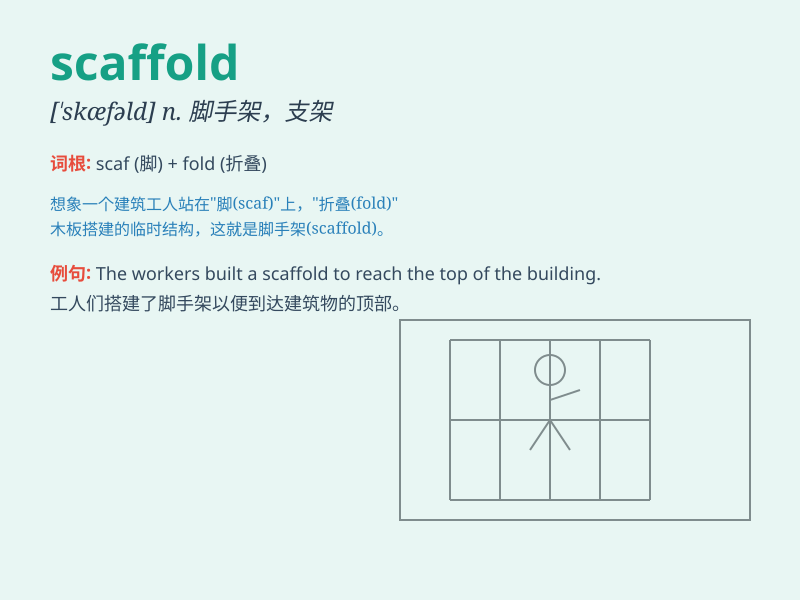

## scaffold

**英音:** _[\'skæfəʊld; -f(ə)ld]_ **美音:**
_[\'skæfold]_

**译义:** *n.[建] 脚手架,绞刑台*

### 短语

+ **scaffold structure:** _脚手架结构_

+ **construction scaffold:** _建筑脚手架_

+ **scaffold platform:** _脚手架平台_

+ **scaffold pole:** _脚手架杆_

+ **remove the scaffold:** _拆除脚手架_

### 例句

#### 例句1

> **The workers erected a scaffold to reach the top of the
building.**

**中文翻译:** 工人们搭起脚手架，到达大楼顶部。

**单词释义:** 脚手架

#### 例句2

> **The criminal was executed on the scaffold.**

**中文翻译:** 罪犯在断头台上被处决。

**单词释义:** 绞刑架

#### 例句3

> **The artist used the scaffold as a metaphor in his painting.**

**中文翻译:** 艺术家在他的画中用脚手架作为隐喻。

**单词释义:** 脚手架；喻指某种框架或支撑结构

### 背诵小故事

> A worker named Tom was building a tall building. He relied on the
scaffold to climb up and down safely. The scaffold was like a reliable
friend, providing support and protection.

**一位名叫汤姆的工人正在建造一座高楼。他依靠脚手架安全地上下攀爬。脚手架就像一个可靠的朋友，提供支持和保护。**

### 图义

