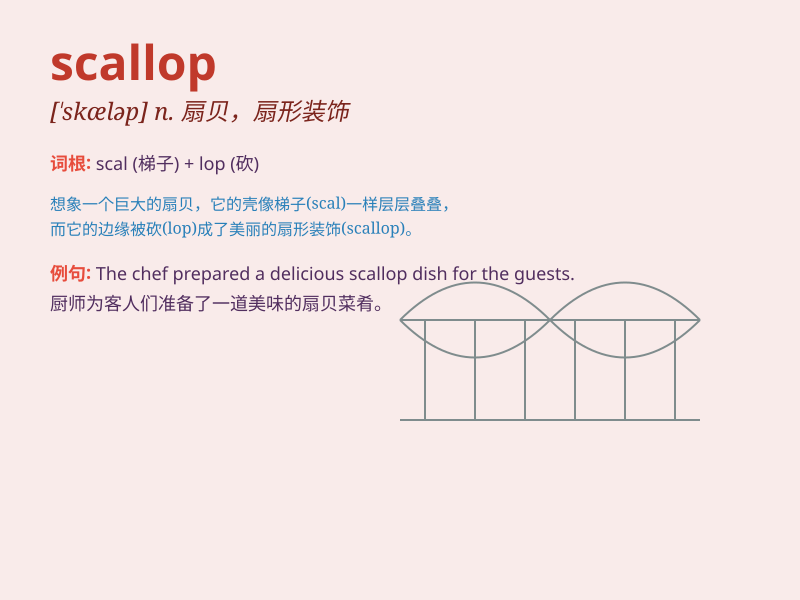

## scallop

**英音:** _[\'skɒləp; \'skæləp]_ **美音:** _[\'skæləp]_

**译义:** *n.扇贝,干贝*

### 短语

+ **scallop shell:** _扇贝壳_

+ **scallop fishery:** _扇贝渔业_

+ **scallop edge:** _扇形边缘_

+ **scallop pattern:** _扇贝图案_

+ **scallop meat:** _扇贝肉_

### 例句

#### 例句1

> **I ordered a plate of scallops for dinner.**

**中文翻译:** 晚餐我点了一盘扇贝。

**单词释义:** 扇贝（名词）

#### 例句2

> **The scallop shells were scattered along the beach.**

**中文翻译:** 扇贝壳散落在海滩上。

**单词释义:** 扇贝（名词）

#### 例句3

> **She decorated the box with scalloped edges.**

**中文翻译:** 她用扇形边缘装饰盒子。

**单词释义:** 扇形的（形容词）

### 背诵小故事

> A little girl went to the beach and found a beautiful scallop. She
was so happy and decided to take it home as a precious souvenir. The
scallop\'s shell was shiny and unique.

**一个小女孩去海滩，发现了一个漂亮的扇贝。她非常高兴，决定把它带回家作为珍贵的纪念品。这个扇贝的壳又亮又独特。**

### 图义

