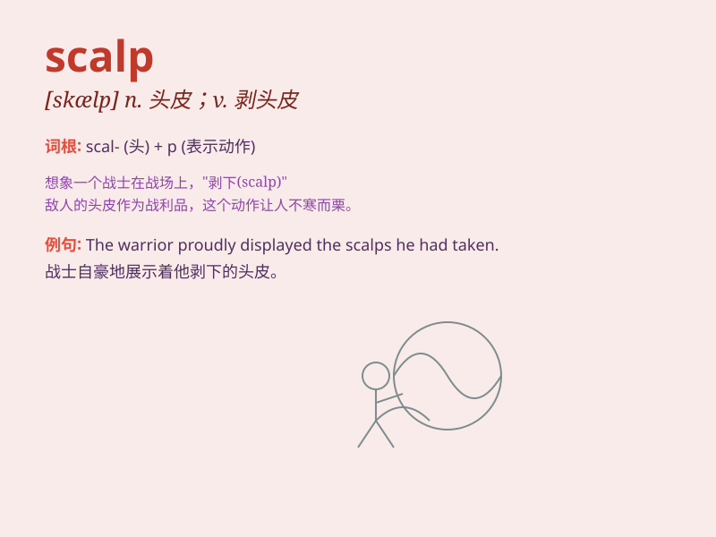

## scalp

**英音:** _[skælp]_ **美音:** _[skælp]_

**译义:** *v.剥头皮n.头皮*

### 短语

+ **scalp lock:** _一绺头发_

+ **scalp wound:** _头皮伤口_

+ **scalp massage:** _头皮按摩_

+ **scalp treatment:** _头皮治疗_

+ **scalp infection:** _头皮感染_

### 例句

#### 例句1

> **The warrior wore a headdress decorated with scalps.**

**中文翻译:** 战士戴着用头皮装饰的头饰。

**单词释义:** 头皮

#### 例句2

> **He managed to scalp a ticket for the sold-out concert.**

**中文翻译:** 他设法抢到了一张门票售空的音乐会门票。

**单词释义:** （以高价）倒卖（票）

#### 例句3

> **The enemy tried to scalp our soldiers, but they failed.**

**中文翻译:** 敌人试图剥我士兵的头皮，但他们失败了。

**单词释义:** 剥头皮

### 背诵小故事

> A brave warrior was in a fierce battle. The enemy tried to seize his
scalp as a trophy, but the warrior fought hard to protect it. Finally,
he emerged victorious, keeping his scalp safe.

**一位勇敢的战士在一场激烈的战斗中。敌人试图夺取他的头皮作为战利品，但战士奋力保护它。最终，他胜利了，保住了自己的头皮。**

### 图义

