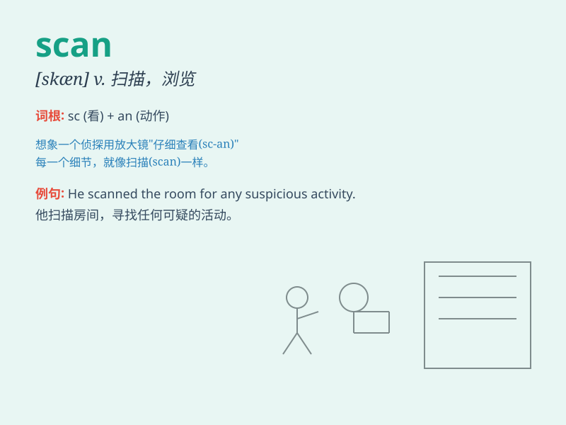

## scan

**英音:** _[skæn]_ **美音:** _[skæn]_

**译义:** *v.细看,审视,浏览,扫描n.扫描*

### 短语

+ **scan through:** _浏览；快速查看_

+ **body scan:** _身体扫描_

+ **brain scan:** _脑部扫描_

+ **scan carefully:** _仔细查看_

+ **scan for:** _搜索；查找_

### 例句

#### 例句1

> **I need to scan this document before sending it.**

**中文翻译:** 我需要在发送之前扫描该文档。

**单词释义:** 扫描

#### 例句2

> **The doctor will scan your body to check for any problems.**

**中文翻译:** 医生会扫描您的身体以检查是否存在任何问题。

**单词释义:** 扫描

#### 例句3

> **She quickly scanned the room to see if anyone was there.**

**中文翻译:** 她快速扫视了一下房间，看看是否有人。

**单词释义:** 扫视

### 背诵小故事

> One day, Tom was looking for a lost book. He had to scan every shelf
in the library carefully. Finally, he found it. The act of looking
carefully is what \'scan\' means.

**一天，汤姆在找一本丢失的书。他不得不仔细查看图书馆的每一个书架。最后，他找到了。这种仔细查看的行为就是'scan'的意思。**

### 图义

