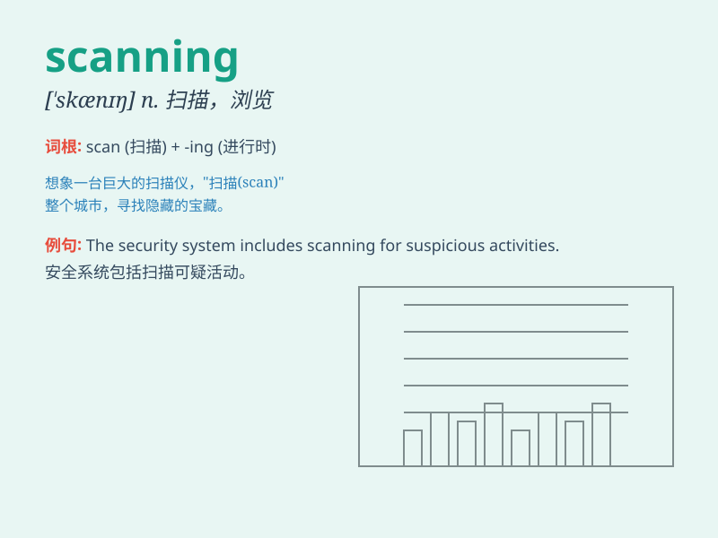

## scanning

**英音:** _[\'skænɪŋ]_ **美音:** _[\'skænɪŋ]_

**译义:** *v.扫描*

### 短语

+ **scanning electron microscope:** _扫描电子显微镜_

+ **scanning device:** _扫描设备_

+ **line scanning:** _行扫描_

+ **scanning speed:** _扫描速度_

+ **scanning system:** _扫描系统_

### 例句

#### 例句1

> **She was scanning the room, looking for her keys.**

**中文翻译:** 她正在扫视房间，寻找她的钥匙。

**单词释义:** 仔细察看；审视

#### 例句2

> **The doctor is scanning the patient\'s brain.**

**中文翻译:** 医生正在扫描病人的大脑。

**单词释义:** 扫描

#### 例句3

> **He spent hours scanning the documents for relevant
information.**

**中文翻译:** 他花了几个小时浏览文件以寻找相关信息。

**单词释义:** 粗略地看；浏览

### 背诵小故事

> One day, I was scanning my favorite comic book quickly to find a
particular scene. I moved my eyes rapidly across the pages, just like a
scanner does. This helped me remember the word \'scanning\' which means
looking carefully and quickly.

**有一天，我快速浏览我最喜欢的漫画书以找到一个特定的场景。我的眼睛快速地在页面上移动，就像扫描仪一样。这帮助我记住了'scanning'这个词，它的意思是快速仔细地查看。**

### 图义

