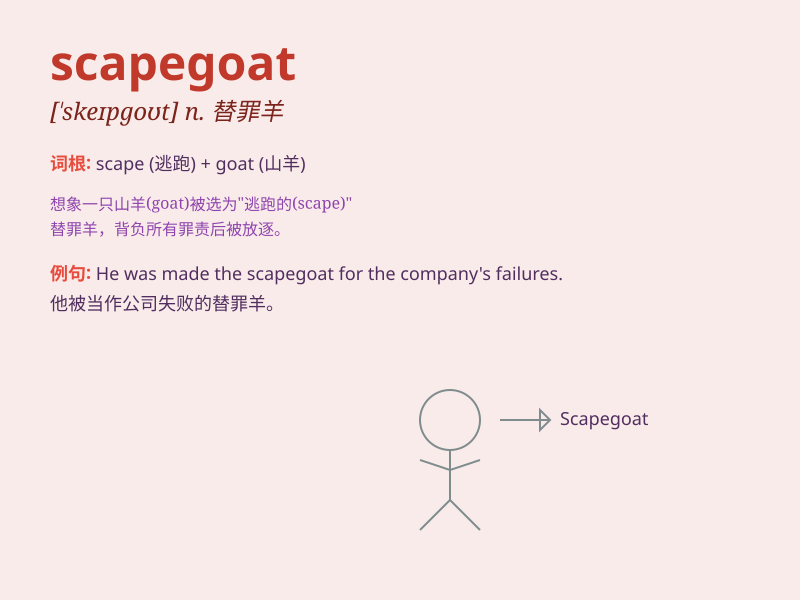

## scapegoat

**英音:** _[\'skeɪpgəʊt]_ **美音:** _[\'skepɡot]_

**译义:** *n.替罪羊*

### 短语

+ **bear the scapegoat:** _承担替罪羊的角色_

+ **find a scapegoat:** _找替罪羊_

+ **make someone a scapegoat:** _使某人成为替罪羊_

+ **act as a scapegoat:** _充当替罪羊_

+ **scapegoat for something:** _某事的替罪羊_

### 例句

#### 例句1

> **He was made the scapegoat for the team\'s failure.**

**中文翻译:** 他成了团队失败的替罪羊。

**单词释义:** 替罪羊

#### 例句2

> **The manager found a scapegoat to take the blame for the
project\'s delay.**

**中文翻译:** 经理找了个替罪羊来为项目的延误承担责任。

**单词释义:** 替罪羊

#### 例句3

> **Don\'t make me your scapegoat when things go wrong.**

**中文翻译:** 事情出错时别把我当你的替罪羊。

**单词释义:** 替罪羊

### 背诵小故事

>
在一个古老的村庄，每当有坏事发生，人们就会把一只可怜的山羊赶到荒野，认为它带走了厄运。这只山羊就是
scapegoat，替罪羊。后来，scapegoat 就用来指那些无辜替人受过的人。

**在一个古老村庄中，每当有坏事发生，人们把一只山羊赶到荒野，认为它带走厄运，这只山羊就是"替罪羊"，后来该词指无辜替人受过的人。**

### 图义

