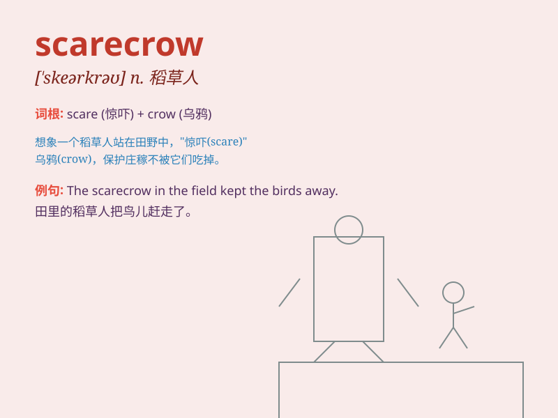

## scarecrow

**英音:** _[ˈskeəkrəʊ]_ **美音:** _[ˈskerkroʊ]_

**译义:** *n.稻草人,衣衫褴褛的人*

### 短语

+ **scarecrow figure:** _稻草人形象_

+ **make a scarecrow:** _制作一个稻草人_

+ **scarecrow costume:** _稻草人服装_

+ **scarecrow field:** _有稻草人的田地_

+ **scarecrow effect:** _稻草人效应_

### 例句

#### 例句1

> **The scarecrow in the field stood motionless, scaring away the
birds.**

**中文翻译:** 田地里的稻草人一动不动地站着，把鸟儿吓走了。

**单词释义:** 稻草人

#### 例句2

> **The children made a scarecrow to protect the garden.**

**中文翻译:** 孩子们做了一个稻草人来保护花园。

**单词释义:** 稻草人

#### 例句3

> **The old scarecrow was worn out and needed to be replaced.**

**中文翻译:** 那个旧稻草人破旧不堪，需要更换了。

**单词释义:** 稻草人

### 背诵小故事

> A farmer was worried about birds eating his crops. So, he made a
scarecrow. It wore old clothes and had a funny hat. The birds were
scared and stayed away. The scarecrow did its job well!

**一位农民担心鸟儿吃他的庄稼。于是，他做了一个稻草人。它穿着旧衣服，戴着一顶滑稽的帽子。鸟儿被吓到了，都飞走了。这个稻草人出色地完成了它的任务！**

### 图义

