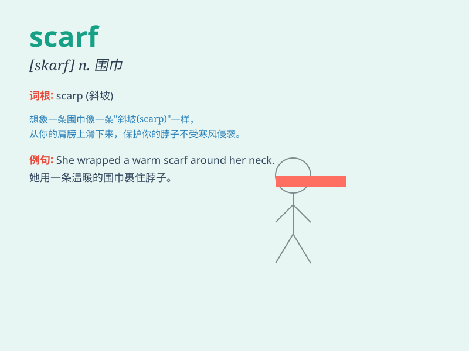

## scarf

**英音:** _[skɑːf]_ **美音:** _[skɑrf]_

**译义:**
*n.围巾,头巾领巾,嵌接,嵌接处,切口v.围(围巾),披(头巾)嵌接*

### 短语

+ **woollen scarf:** _羊毛围巾_

+ **silk scarf:** _丝绸围巾_

+ **scarf down:** _狼吞虎咽地吃_

+ **fashion scarf:** _时尚围巾_

+ **winter scarf:** _冬季围巾_

### 例句

#### 例句1

> **She wore a colorful scarf to keep warm.**

**中文翻译:** 她戴了一条色彩鲜艳的围巾来保暖。

**单词释义:** 围巾

#### 例句2

> **He gave her a silk scarf as a gift.**

**中文翻译:** 他送了她一条丝绸围巾作为礼物。

**单词释义:** 围巾

#### 例句3

> **The wind blew her scarf off her shoulders.**

**中文翻译:** 风把她肩上的围巾吹掉了。

**单词释义:** 围巾

### 背诵小故事

> A girl was lost in the forest. It was very cold. Luckily, she found a
scarf. The scarf was colorful and warm. It protected her from the cold
wind and made her feel safe.

**一个女孩在森林里迷路了。天气非常冷。幸运的是，她找到了一条围巾。这条围巾色彩鲜艳且温暖。它保护她免受寒风侵袭，让她感到安全。**

### 图义

