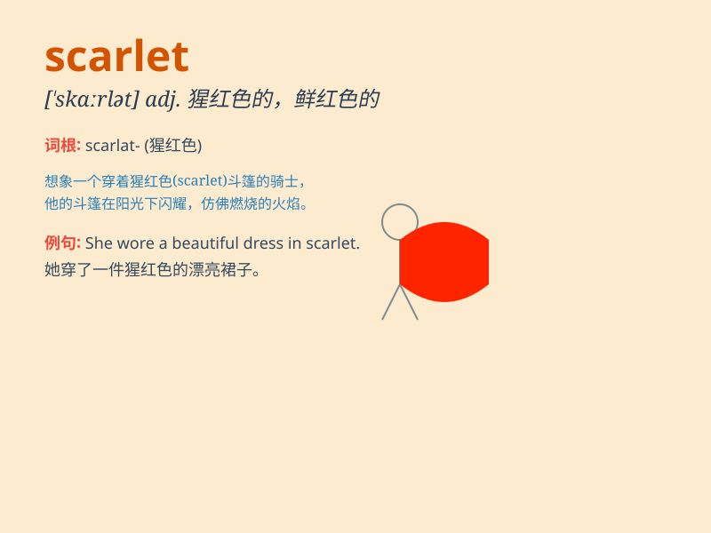

## scarlet

**英音:** _[\'skɑːlət]_ **美音:** _[\'skɑrlɪt]_

**译义:** *n.猩红色,鲜红色布adj.猩红的,鲜红的,深红的*

### 短语

+ **scarlet fever:** _猩红热_

+ **scarlet letter:** _红字（小说名）；耻辱的象征_

+ **scarlet woman:** _淫妇；妓女_

+ **scarlet pimpernel:** _海绿（植物名）_

+ **scarlet tanager:** _猩红丽唐纳雀（鸟名）_

### 例句

#### 例句1

> **The woman wore a scarlet dress to the party.**

**中文翻译:** 这位女士穿着一条猩红色的连衣裙去参加聚会。

**单词释义:** 猩红色的

#### 例句2

> **The scarlet leaves of the maple tree were a beautiful sight in
autumn.**

**中文翻译:** 秋天，枫树上猩红色的叶子是一道美丽的风景。

**单词释义:** 猩红色的

#### 例句3

> **Her face turned scarlet with embarrassment.**

**中文翻译:** 她的脸因尴尬而变得通红。

**单词释义:** 通红的

### 背诵小故事

> A brave knight wore a scarlet cape as he charged into battle. The
color scarlet was so bright and bold, making him stand out among the
others. It was a symbol of his courage and strength.

**一位勇敢的骑士在冲锋陷阵时身披猩红色的披风。猩红色是如此鲜艳和醒目，使他在众人中脱颖而出。这是他勇气和力量的象征。**

### 图义

