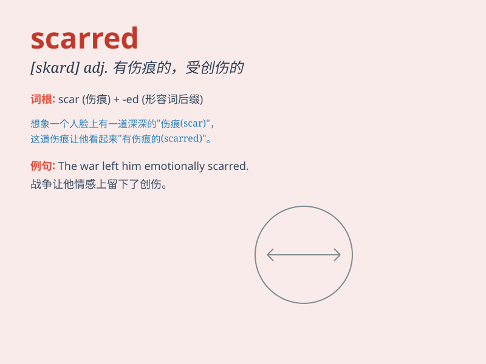

## scarred

**英音:** _[skɑːd]_ **美音:** _[skɑrd]_

**译义:** *adj. 有伤痕的，受创伤的；（表面）有划痕的*

### 短语

+ **scarred landscape:** _伤痕累累的地貌_

+ **scarred heart:** _受伤的心_

+ **scarred skin:** _有伤疤的皮肤_

+ **scarred memory:** _痛苦的回忆_

+ **emotionally scarred:** _情感上受到创伤_

### 例句

#### 例句1

> **The soldier\'s face was scarred from the battle.**

**中文翻译:** 这位士兵的脸因战斗而留下了伤疤。

**单词释义:** 有伤疤的

#### 例句2

> **Her heart was scarred by the painful breakup.**

**中文翻译:** 她的心因痛苦的分手而伤痕累累。

**单词释义:** 受到创伤的

#### 例句3

> **The landscape was scarred by deforestation.**

**中文翻译:** 这片风景因滥伐森林而变得满目疮痍。

**单词释义:** 被破坏的；有疤痕的

### 背诵小故事

> A brave warrior was always in fierce battles. One day, a sharp sword
left a deep mark on his face, making him scarred. But he wore the scar
as a badge of honor, showing his strength and courage.

**一位勇敢的战士总是身处激烈的战斗中。有一天，一把锋利的剑在他脸上留下了深深的痕迹，使他伤痕累累。但他把这道伤疤当作荣誉的徽章，展现着他的力量和勇气。**

### 图义

