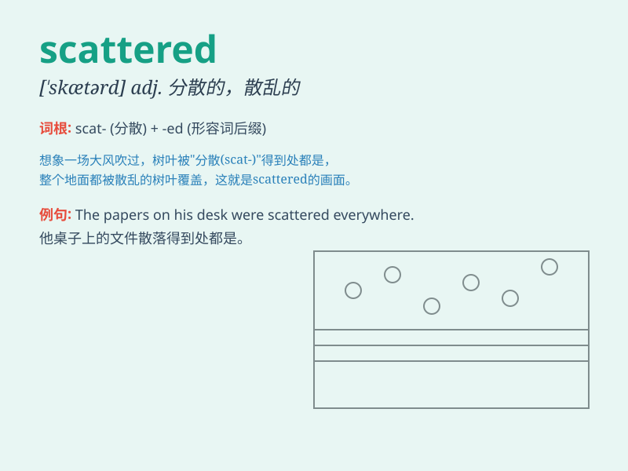

## scattered

**英音:** _[\'skætəd]_ **美音:** _[\'skætɚd]_

**译义:** *a.分散的*

### 短语

+ **scattered showers:** _零星阵雨_

+ **scattered villages:** _分散的村庄_

+ **scattered light:** _散射光_

+ **scattered thoughts:** _分散的想法；杂乱的思绪_

+ **scattered distribution:** _分散分布_

### 例句

#### 例句1

> **The books were scattered all over the floor.**

**中文翻译:** 书散落得满地都是。

**单词释义:** 分散；散布

#### 例句2

> **The clouds were scattered across the sky.**

**中文翻译:** 云在天空中四散开来。

**单词释义:** 散开；分散

#### 例句3

> **His thoughts were scattered and he couldn\'t focus.**

**中文翻译:** 他的思绪分散，无法集中注意力。

**单词释义:** 分散；凌乱

### 背诵小故事

> A group of birds were flying in the sky. Suddenly, a strong wind blew
and scattered them in all directions. The scattered birds had to find
their way back home alone.

**一群鸟在天空中飞翔。突然，一阵强风吹来，把它们吹得四处分散。分散的鸟儿不得不独自寻找回家的路。**

### 图义

