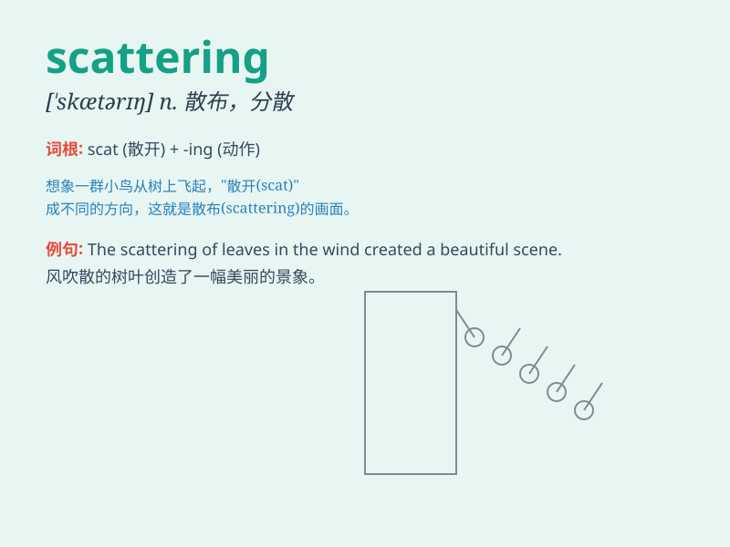

## scattering

**英音:** _[\'skætərɪŋ]_ **美音:** _[\'skætərɪŋ]_

**译义:** *n.散射*

### 短语

+ **scattering angle:** _散射角_

+ **scattering coefficient:** _散射系数_

+ **scattering experiment:** _散射实验_

+ **scattering cross section:** _散射截面_

+ **random scattering:** _随机散射_

### 例句

#### 例句1

> **The scattering of light makes the sky appear blue.**

**中文翻译:** 光的散射使得天空呈现蓝色。

**单词释义:** 散射

#### 例句2

> **There was a scattering of books on the floor.**

**中文翻译:** 地板上零星地放着一些书。

**单词释义:** 零星分布

#### 例句3

> **The scattering of the crowd was chaotic after the concert
ended.**

**中文翻译:** 音乐会结束后人群的分散很混乱。

**单词释义:** 分散

### 背诵小故事

> A group of birds was flying in the sky. Suddenly, a loud noise scared
them, causing a scattering of the flock in all directions. They flew
away quickly, disappearing into the distance.

**一群鸟正在天空飞翔。突然，一声巨响吓到了它们，导致鸟群向四面八方分散。它们迅速飞走，消失在远方。**

### 图义

