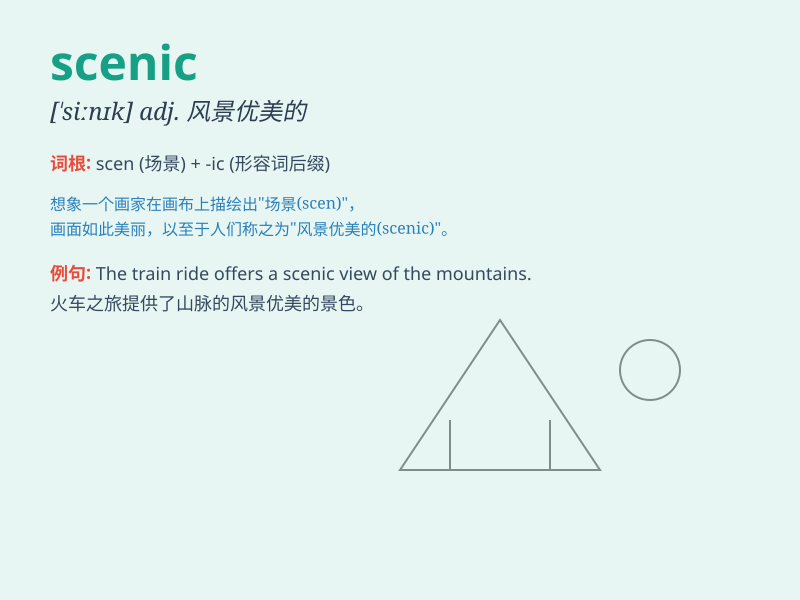

## scenic

**英音:** _[\'siːnɪk]_ **美音:** _[ˈsinɪk]_

**译义:**
*adj.舞台的,布景的,景色优美的,戏剧性的n.风景照片,风景影片*

### 短语

+ **scenic spot:** _景点；风景区_

+ **scenic route:** _风景优美的路线_

+ **scenic beauty:** _风景美_

+ **scenic drive:** _风景驾车路线_

+ **scenic area:** _景区；风景区域_

### 例句

#### 例句1

> **The scenic route along the coast is breathtaking.**

**中文翻译:** 沿着海岸的风景路线令人叹为观止。

**单词释义:** 风景优美的

#### 例句2

> **We went on a scenic drive through the mountains.**

**中文翻译:** 我们开车穿过群山，风景如画。

**单词释义:** 风景如画的

#### 例句3

> **The park is known for its scenic beauty.**

**中文翻译:** 该公园以其风景优美而闻名。

**单词释义:** 风景秀丽的

### 背诵小故事

> One day, I went on a trip. The route was scenic. I saw beautiful
mountains, clear rivers and vast grasslands. It was such a wonderful
scene that I\'ll never forget.

**有一天，我去旅行。路线风景优美。我看到了美丽的山、清澈的河流和广阔的草原。那是如此美妙的景色，我永远不会忘记。**

### 图义

