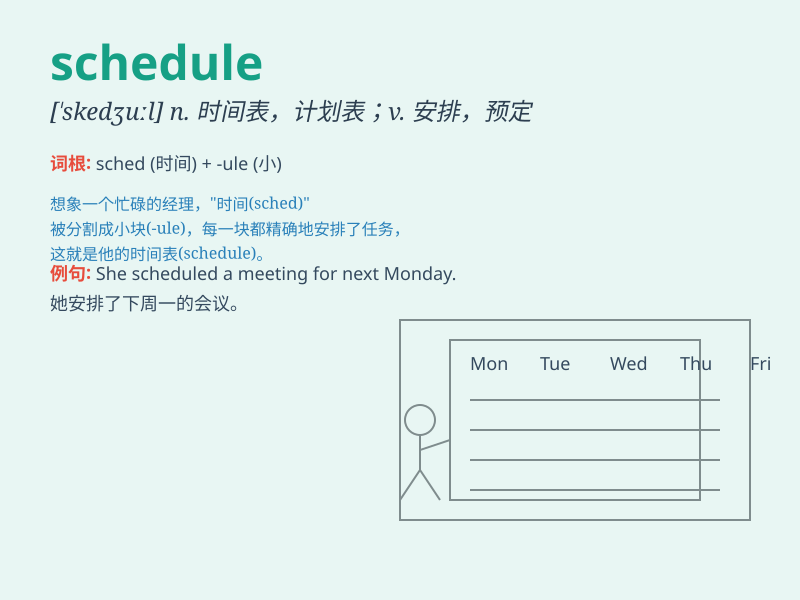

## schedule

**英音:** _[ˈʃedju:l]_ **美音:** _[ˈskedʒʊl; skɛdʒʊl]_

**译义:** *n.时间表,进度表v.确定时间*

### 短语

+ **on schedule:** _按时；按预定时间_

+ **ahead of schedule:** _提前_

+ **behind schedule:** _落后于预定计划；晚点_

+ **production schedule:** _生产进度表；生产计划_

+ **class schedule:** _课程表；课表_

### 例句

#### 例句1

> **The meeting is scheduled for 3 p.m. tomorrow.**

**中文翻译:** 会议定于下午 3 点举行。明天。

**单词释义:** 安排；预定

#### 例句2

> **I have a busy schedule this week.**

**中文翻译:** 这周我的日程很忙。

**单词释义:** 日程；计划表

#### 例句3

> **The train schedule has changed.**

**中文翻译:** 火车时刻表已更改。

**单词释义:** 时刻表

### 背诵小故事

>
想象一下，你是一位超级英雄，每天都要按照一个神秘的\'schedule\'行动。这个\'schedule\'就像一张藏宝图，指引你何时拯救世界、何时休息。它详细规定了你每一个重要时刻的任务，让你的行动有条不紊。

**想象一下，你是一位超级英雄，每天都要按照一个神秘的'时间表'行动。这个'时间表'就像一张藏宝图，指引你何时拯救世界、何时休息。它详细规定了你每一个重要时刻的任务，让你的行动有条不紊。**

### 图义

