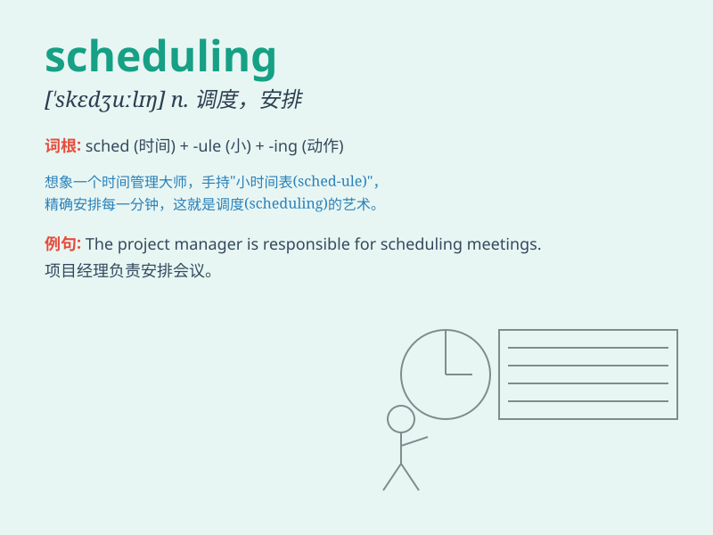

## scheduling

**英音:** _[ˈʃedjuːlɪŋ]_ **美音:** _[ˈskedʒuːlɪŋ]_

**译义:** *n.行程安排,时序安排*

### 短语

+ **scheduling algorithm:** _调度算法_

+ **scheduling problem:** _调度问题_

+ **task scheduling:** _任务调度_

+ **production scheduling:** _生产调度_

+ **resource scheduling:** _资源调度_

### 例句

#### 例句1

> **The scheduling of the meeting was done very efficiently.**

**中文翻译:** 会议的安排非常高效。

**单词释义:** 安排；计划

#### 例句2

> **Scheduling conflicts often arise in a busy workplace.**

**中文翻译:** 在繁忙的工作场所中经常会出现日程安排冲突。

**单词释义:** 日程安排

#### 例句3

> **The airline\'s scheduling system was updated to improve customer
service.**

**中文翻译:** 该航空公司的调度系统已更新，以改善客户服务。

**单词释义:** 航班安排

### 背诵小故事

> 想象一下，一个忙碌的办公室，老板正在为各种项目做
scheduling（安排日程）。他仔细地在本子上写下时间和任务，确保每个员工都能高效工作。有了合理的
scheduling，一切都井井有条。

**想象一下，一个忙碌的办公室，老板正在为各种项目做安排日程。他仔细地在本子上写下时间和任务，确保每个员工都能高效工作。有了合理的安排日程，一切都井井有条。**

### 图义

