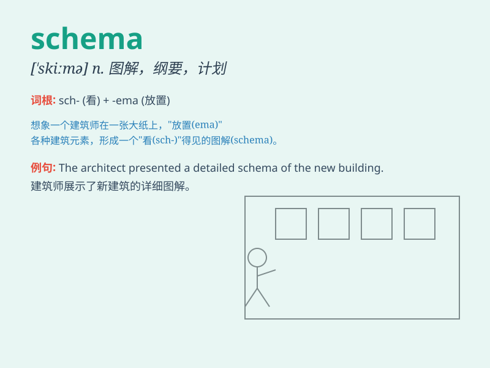

## schema

**英音:** _[\'skiːmə]_ **美音:** _[\'skimə]_

**译义:** *n.计划*

### 短语

+ **database schema:** _数据库模式_

+ **conceptual schema:** _概念模式_

+ **logical schema:** _逻辑模式_

+ **physical schema:** _物理模式_

+ **schema definition:** _模式定义_

### 例句

#### 例句1

> **The database schema needs to be updated to accommodate the new
data types.**

**中文翻译:** 数据库模式需要更新以适应新的数据类型。

**单词释义:** 模式；图表；概要

#### 例句2

> **She presented a schema for organizing the project
effectively.**

**中文翻译:** 她提出了一个有效组织该项目的方案。

**单词释义:** 方案；计划

#### 例句3

> **The schema of this book is quite clear and easy to follow.**

**中文翻译:** 本书的架构非常清晰且易于理解。

**单词释义:** 结构；框架

### 背诵小故事

>
想象一下，有个神秘的魔法师，他有一本独特的魔法手册（schema），里面详细记载着各种神奇魔法的规则和结构。只要按照手册行事，就能施展强大魔法。

**想象有个魔法师和记载魔法规则结构的手册来辅助记住单词【schema】，意思是模式、图表、纲要**

### 图义

