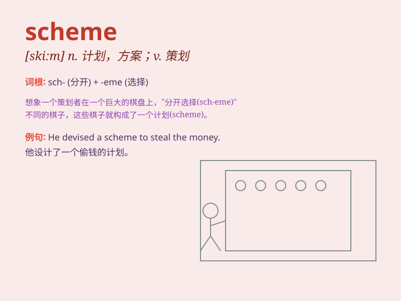

## scheme

**英音:** _[skiːm]_ **美音:** _[skim]_

**译义:**
*n.安排,配置,计划,阴谋,方案,图解,摘要v.计划,设计,图谋,策划*

### 短语

+ **color scheme:** _配色方案；色彩搭配_

+ **pension scheme:** _养老金计划_

+ **design scheme:** _设计方案_

+ **training scheme:** _培训计划_

+ **marketing scheme:** _营销方案_

### 例句

#### 例句1

> **The company has come up with a new marketing scheme.**

**中文翻译:** 该公司想出了一个新的营销方案。

**单词释义:** 方案；计划

#### 例句2

> **He was arrested for his part in the illegal scheme.**

**中文翻译:** 他因参与非法计划而被捕。

**单词释义:** 计划；阴谋

#### 例句3

> **The color scheme of the room is very pleasant.**

**中文翻译:** 房间的配色方案非常宜人。

**单词释义:** 搭配；组合

### 背诵小故事

> A group of friends wanted to go on a vacation. They made a scheme to
save money by sharing expenses. They planned every detail carefully and
finally had a wonderful trip.

**一群朋友想去度假。他们制定了一个方案，通过分担费用来省钱。他们仔细规划了每一个细节，最终度过了一次美妙的旅行。**

### 图义

