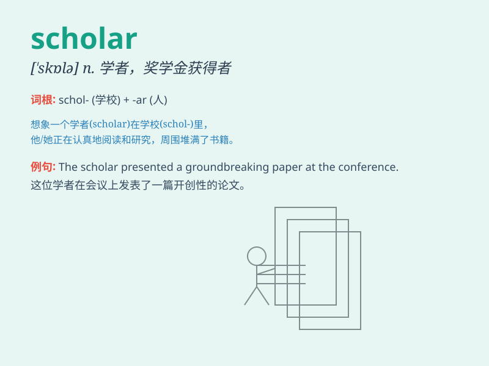

## scholar

**英音:** _[\'skɒlə]_ **美音:** _[\'skɑlɚ]_

**译义:** *n.学者*

### 短语

+ **academic scholar:** _学术学者_

+ **prominent scholar:** _杰出的学者_

+ **scholar athlete:** _学者运动员_

+ **visiting scholar:** _访问学者_

+ **scholar in residence:** _住校学者_

### 例句

#### 例句1

> **He is a renowned scholar in the field of history.**

**中文翻译:** 他是历史学领域的著名学者。

**单词释义:** 学者

#### 例句2

> **The scholar spent years researching that ancient
civilization.**

**中文翻译:** 这位学者花了数年时间研究那个古老的文明。

**单词释义:** 学者

#### 例句3

> **She was awarded a scholarship to become a scholar.**

**中文翻译:** 她获得了奖学金，成为一名学者。

**单词释义:** 学者

### 背诵小故事

> Once upon a time, there was a smart boy named Tom. He loved reading
and learning. Day after day, he became a real scholar. Everyone praised
his knowledge and wisdom. He was like a shining star in the world of
learning.

**从前，有个聪明的男孩叫汤姆。他热爱阅读和学习。日复一日，他成为了一名真正的学者。每个人都称赞他的知识和智慧。他就像学习世界里一颗闪耀的星星。**

### 图义

