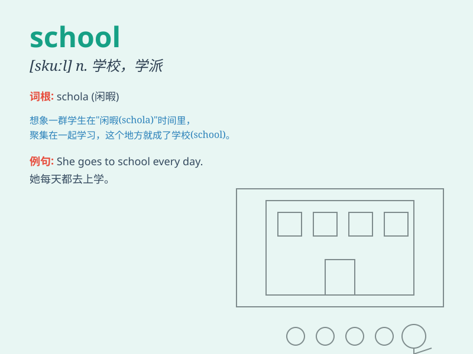

## school

**英音:** _[skuːl]_ **美音:** _[skul]_

**译义:** *n.学校,学院,学习,授课,求学,全体学生,学派vt.锻炼,教育*

### 短语

+ **go to school:** _去上学_

+ **after school:** _放学后_

+ **at school:** _在学校；在上学_

+ **school uniform:** _校服_

+ **high school:** _高中_

### 例句

#### 例句1

> **I go to school by bus every day.**

**中文翻译:** 我每天乘公共汽车去学校。

**单词释义:** 学校

#### 例句2

> **The school is very beautiful.**

**中文翻译:** 学校非常漂亮。

**单词释义:** 学校

#### 例句3

> **She finished school two years ago.**

**中文翻译:** 她两年前完成学业。

**单词释义:** 学业；上学

### 背诵小故事

> A little boy was lost. A kind lady found him and asked where he
should go. The boy said, \'I should go to school.\' The lady helped him
reach there. School is where we study and grow.

**一个小男孩迷路了。一位善良的女士发现了他并问他应该去哪里。男孩说：'我应该去学校。'女士帮助他到了那里。学校是我们学习和成长的地方。**

### 图义

