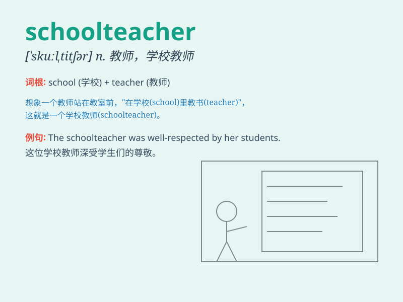

## schoolteacher

**英音:** _[\'skuːltiːtʃə]_ **美音:** _[\'skultitʃɚ]_

**译义:** *n.教师*

### 短语

+ **experienced schoolteacher:** _经验丰富的教师_

+ **primary schoolteacher:** _小学教师_

+ **popular schoolteacher:** _受欢迎的教师_

+ **dedicated schoolteacher:** _敬业的教师_

+ **newly qualified schoolteacher:** _新获得资格的教师_

### 例句

#### 例句1

> **The schoolteacher is very patient with her students.**

**中文翻译:** 学校老师对她的学生非常有耐心。

**单词释义:** 学校教师

#### 例句2

> **My sister is a schoolteacher and she loves her job.**

**中文翻译:** 我姐姐是一名教师，她热爱她的工作。

**单词释义:** 学校教师

#### 例句3

> **The schoolteacher explained the difficult concept clearly.**

**中文翻译:** 老师清楚地解释了这个困难的概念。

**单词释义:** 学校教师

### 背诵小故事

> One day, a little boy was very naughty in class. The schoolteacher
was not angry but patiently taught him. The boy finally understood and
promised to be good. The schoolteacher smiled with satisfaction.

**有一天，一个小男孩在课堂上非常调皮。学校老师没有生气，而是耐心地教导他。男孩最终明白了，并承诺会变好。学校老师满意地笑了。**

### 图义

