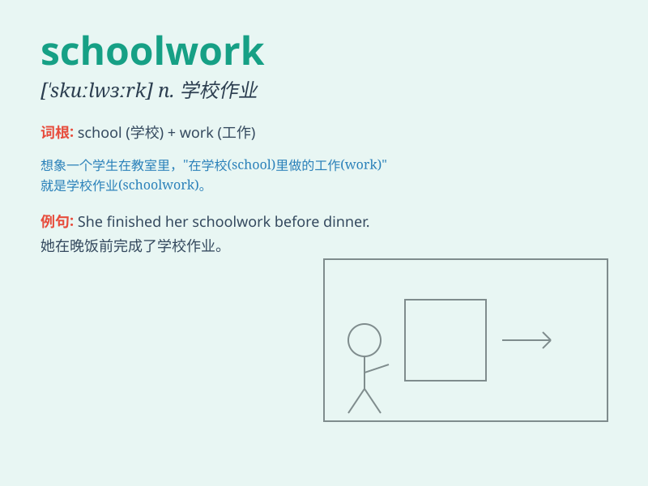

## schoolwork

**英音:** _[\'skuːlwɜːk]_ **美音:** _[\'skʊl,wɝk]_

**译义:** *n.(包括课堂作业和家庭作业)作业*

### 短语

+ **finish schoolwork:** _完成功课_

+ **do schoolwork:** _做功课_

+ **hand in schoolwork:** _交功课_

+ **check schoolwork:** _检查功课_

+ **help with schoolwork:** _帮忙做功课_

### 例句

#### 例句1

> **I have a lot of schoolwork to finish this weekend.**

**中文翻译:** 这个周末我有很多功课要完成。

**单词释义:** 功课；学业任务

#### 例句2

> **She always does her schoolwork carefully.**

**中文翻译:** 她总是认真地做功课。

**单词释义:** 功课

#### 例句3

> **The heavy schoolwork makes him feel stressed.**

**中文翻译:** 繁重的课业让他感到压力很大。

**单词释义:** 学业任务

### 背诵小故事

> One day, Tom was very worried because he had a lot of schoolwork to
finish. But with his hard work and time management, he finally completed
all the tasks and felt proud. Schoolwork means the work students do for
school.

**有一天，汤姆非常担心，因为他有很多功课要完成。但通过他的努力和时间管理，他最终完成了所有任务，并感到自豪。schoolwork
意思是学生为学校做的功课。**

### 图义

