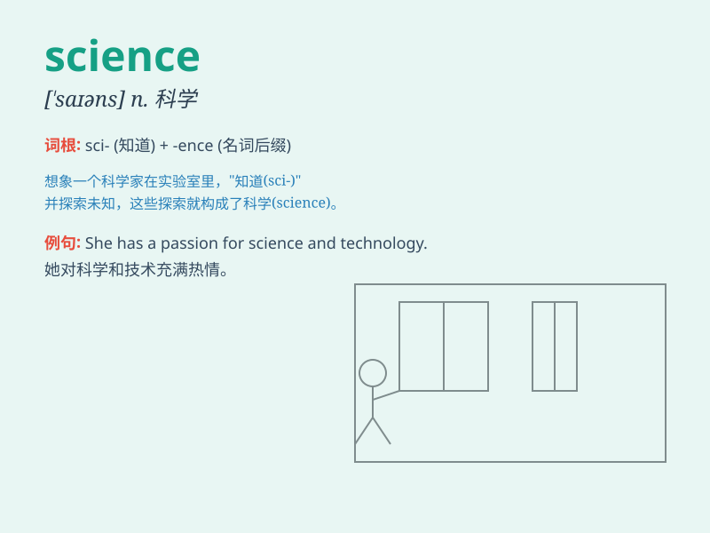

## science

**英音:** _[\'saɪəns]_ **美音:** _[\'saɪəns]_

**译义:** *n.科学,自然科学,理科*

### 短语

+ **natural science:** _自然科学_

+ **social science:** _社会科学_

+ **political science:** _政治学_

+ **computer science:** _计算机科学_

+ **science fiction:** _科幻小说_

### 例句

#### 例句1

> **Science has made great progress in recent years.**

**中文翻译:** 近年来，科学取得了长足的进步。

**单词释义:** 科学

#### 例句2

> **She is passionate about science and dreams of becoming a
scientist.**

**中文翻译:** 她对科学充满热情，梦想成为一名科学家。

**单词释义:** 科学

#### 例句3

> **The school offers various courses in science, such as physics and
chemistry.**

**中文翻译:** 学校提供各种科学课程，例如物理和化学。

**单词释义:** 科学

### 背诵小故事

> One day, a little boy was very curious about the world. He asked many
questions and wanted to find answers. His mom told him that\'science\'
can help him. With science, he could understand how things work and
discover many secrets.

**有一天，一个小男孩对世界非常好奇。他问了很多问题并想找到答案。他妈妈告诉他"科学"能帮助他。有了科学，他就能明白事物是如何运作的，并发现很多秘密。**

### 图义

