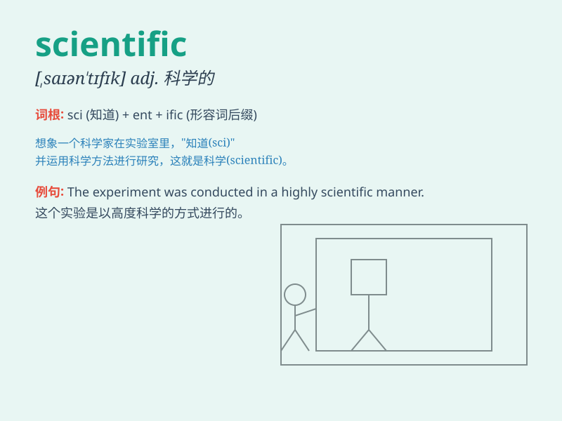

## scientific

**英音:** _[saɪən\'tɪfɪk]_ **美音:** _[,saɪən\'tɪfɪk]_

**译义:** *adj.科学的*

### 短语

+ **scientific research:** _科学研究_

+ **scientific method:** _科学方法_

+ **scientific community:** _科学界_

+ **scientific knowledge:** _科学知识_

+ **scientific discovery:** _科学发现_

### 例句

#### 例句1

> **The scientific method is widely used in research.**

**中文翻译:** 科学方法广泛应用于研究中。

**单词释义:** 科学的

#### 例句2

> **She has made a significant scientific discovery.**

**中文翻译:** 她取得了一项重大的科学发现。

**单词释义:** 科学的

#### 例句3

> **This is a scientific experiment to test the hypothesis.**

**中文翻译:** 这是一个检验假设的科学实验。

**单词释义:** 科学的

### 背诵小故事

>
有一天，小明参加科学展览，看到各种神奇的发明，他感叹这都是科学家们（scientists）运用科学（scientific）方法创造的。科学让世界变得更美好，也让小明对未知充满好奇。

**有一天，小明参加科学展览，看到各种神奇发明，他感叹这是科学家运用科学方法创造的，科学让世界更美好，让小明好奇未知。**

### 图义

