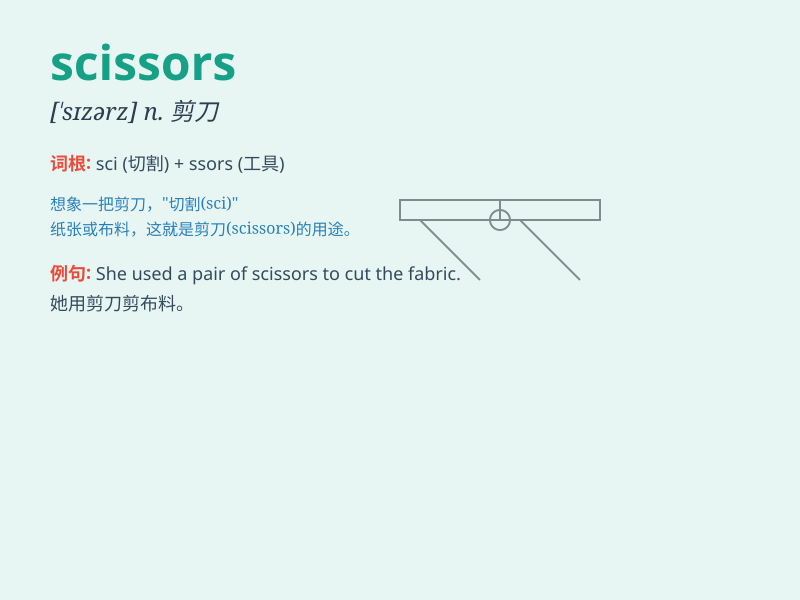

## scissors

**英音:** _[\'sɪzəz]_ **美音:** _[\'sɪzɚz]_

**译义:** *n.pl.剪刀*

### 短语

+ **a pair of scissors:** _一把剪刀_

+ **cut with scissors:** _用剪刀剪_

+ **sharp scissors:** _锋利的剪刀_

+ **disposable scissors:** _一次性剪刀_

+ **scissors gesture:** _剪刀手势_

### 例句

#### 例句1

> **I need a pair of scissors to cut this paper.**

**中文翻译:** 我需要一把剪刀来剪这张纸。

**单词释义:** 剪刀

#### 例句2

> **The scissors are too dull to use.**

**中文翻译:** 剪刀太钝了，无法使用。

**单词释义:** 剪刀

#### 例句3

> **She picked up the scissors and began to trim her hair.**

**中文翻译:** 她拿起剪刀，开始修剪头发。

**单词释义:** 剪刀

### 背诵小故事

> One day, a little mouse needed to cut some paper. It searched
everywhere and finally found a pair of scissors. With the help of
scissors, the mouse easily cut the paper into various shapes. Scissors
are really useful tools!

**有一天，一只小老鼠需要剪纸。它到处找，最后找到了一把剪刀。在剪刀的帮助下，老鼠轻松地把纸剪成了各种形状。剪刀真是有用的工具！**

### 图义

