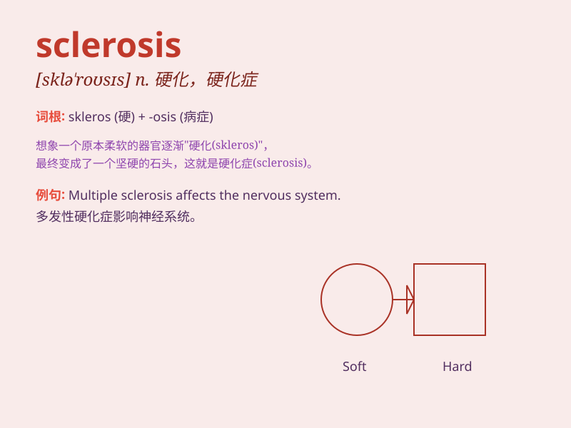

## sclerosis

**英音:** _[sklɪə\'rəʊsɪs; sklə-]_ **美音:**
_[sklə\'rosɪs]_

**译义:** *n.[医]硬化症,硬化,硬结*

### 短语

+ **multiple sclerosis:** _多发性硬化_

+ **systemic sclerosis:** _系统性硬化症_

+ **cerebral sclerosis:** _脑硬化_

+ **arterial sclerosis:** _动脉硬化_

+ **renal sclerosis:** _肾硬化_

### 例句

#### 例句1

> **The doctor diagnosed sclerosis of the liver.**

**中文翻译:** 医生诊断为肝脏硬化。

**单词释义:** 硬化（症）

#### 例句2

> **Arterial sclerosis can lead to serious health problems.**

**中文翻译:** 动脉硬化会导致严重的健康问题。

**单词释义:** 硬化

#### 例句3

> **Multiple sclerosis is a chronic disease that affects the nervous
system.**

**中文翻译:** 多发性硬化症是一种影响神经系统的慢性疾病。

**单词释义:** 硬化症

### 背诵小故事

>
想象一个人的身体像老旧的机器，零件逐渐硬化。这就像'sclerosis'，身体的组织变得僵硬，不再灵活。就像血管硬化，肌肉硬化，活动变得困难。

**想象身体组织硬化的情景来辅助记忆'sclerosis'（硬化症）这个单词**

### 图义

