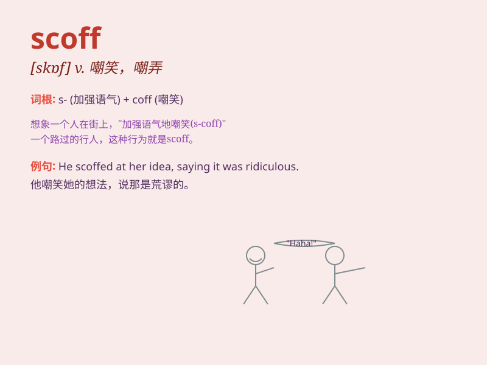

## scoff

**英音:** _[skɒf]_ **美音:** _[skɔf]_

**译义:**
*n.嘲笑,嘲弄的话,嘲弄的对象,愚弄,笑柄,食品v.轻蔑地说,嘲笑,嘲弄,贪吃,狼吞虎咽*

### 短语

+ **scoff at:** _嘲笑；轻视_

+ **scoff down:** _狼吞虎咽地吃_

+ **scoff something away:** _很快地吃光某物_

+ **scoff out:** _大声嘲笑_

+ **scoff openly:** _公然嘲笑_

### 例句

#### 例句1

> **He scoffed at the idea of going on a diet.**

**中文翻译:** 他对节食的想法嗤之以鼻。

**单词释义:** 嘲笑，讥讽

#### 例句2

> **Don\'t scoff until you\'ve tried it.**

**中文翻译:** 在尝试之前不要嘲笑它。

**单词释义:** 嘲笑，轻视

#### 例句3

> **She scoffed the entire pizza by herself.**

**中文翻译:** 她一个人把整个披萨吃完了。

**单词释义:** 贪婪地吃，大口地吃

### 背诵小故事

> One day, Tom saw a man scoffing at the poor beggar on the street. Tom
was angry and taught the man a lesson. \'Scoff\' means to show
disrespect or mock someone rudely.

**有一天，汤姆看到一个人在街上嘲笑那个可怜的乞丐。汤姆很生气，并教训了那个人。\'scoff\'这个单词的意思是不尊重地、粗鲁地嘲笑某人。**

### 图义

