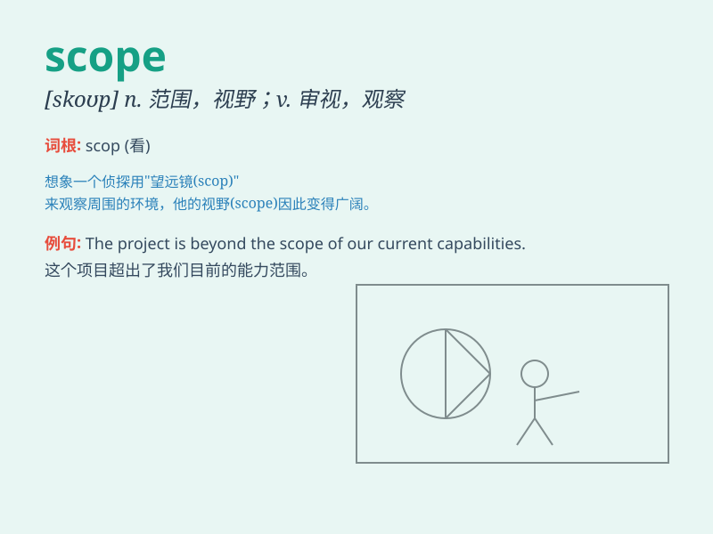

## scope

**英音:** _[skəʊp]_ **美音:** _[skop]_

**译义:** *n.(活动)范围,机会,余地*

### 短语

+ **within the scope:** _在范围内_

+ **scope of work:** _工作范围_

+ **scope out:** _打量；观察_

+ **broad scope:** _广阔的范围_

+ **limited scope:** _有限的范围_

### 例句

#### 例句1

> **The scope of this project is much larger than we initially
thought.**

**中文翻译:** 这个项目的范围比我们最初想象的要大得多。

**单词释义:** 范围；范畴

#### 例句2

> **The telescope allows us to expand the scope of our
observations.**

**中文翻译:** 望远镜使我们能够扩大观测范围。

**单词释义:** 范围；视野

#### 例句3

> **This job offers a wide scope for your creativity.**

**中文翻译:** 这份工作为你的创造力提供了广阔的空间。

**单词释义:** 机会；余地

### 背诵小故事

> A scientist was exploring a new land. He used a telescope to look far
and wide. The area he could observe was the scope of his exploration. It
was like a boundary within which he discovered new things.

**一位科学家正在探索一片新土地。他用望远镜向四周眺望。他所能观察到的区域就是他探索的范围。这就像是一个他能发现新事物的边界。**

### 图义

