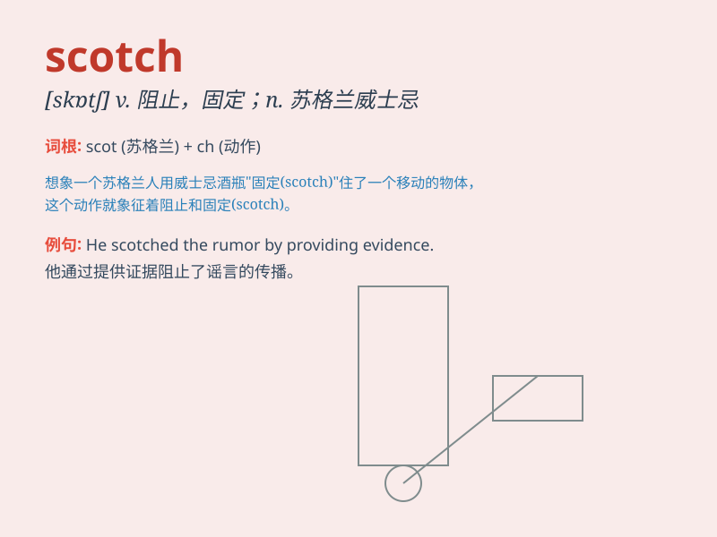

## Scotch

**英音:** _[skɒtʃ]_ **美音:** _[skɑːtʃ]_

**译义:** *n. 苏格兰威士忌酒; 苏格兰人; 苏格兰语; vt. 抑制; 磨光;
打上刻痕*

### 短语

+ **Scotch mist:** _浓雾；（苏格兰的）蒙蒙细雨_

+ **Scotch egg:** _苏格兰煮蛋（用香肠肉包裹煮的鸡蛋）_

+ **Scotch whisky:** _苏格兰威士忌_

+ **Scotch pine:** _欧洲赤松_

+ **put the Scotch on:** _阻止；制止_

### 例句

#### 例句1

> **The Scotch whisky is famous all over the world.**

**中文翻译:** 苏格兰威士忌举世闻名。

**单词释义:** 苏格兰的

#### 例句2

> **He tried to scotch the rumor.**

**中文翻译:** 他试图辟谣。

**单词释义:** 阻止；挫败

#### 例句3

> **Don\'t scotch the snake; it will bite you if you do.**

**中文翻译:** 别去招惹那条蛇，否则它会咬你的。

**单词释义:** 激怒；招惹

### 背诵小故事

> A brave knight was on a quest. He came across a magical potion
labeled \'Scotch\'. When he drank it, he gained super strength. But he
had to be careful not to rely on it too much. Remember, Scotch can be
powerful and mysterious!

**一位勇敢的骑士正在进行探索。他遇到了一瓶标有"Scotch（阻止；挫败）"的神奇药水。当他喝下它时，获得了超强的力量。但他必须小心，不能过度依赖它。记住，Scotch
可以是强大且神秘的！**

### 图义

