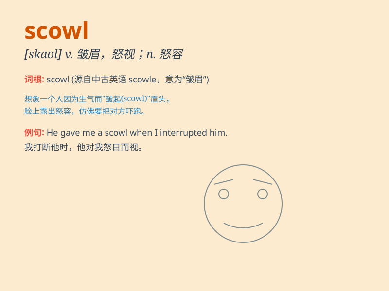

## scowl

**英音:** _[skaʊl]_ **美音:** _[skaʊl]_

**译义:**
*n.愁容,怒容,暴风雨前的阴沉晦暗vi.皱眉头,怒目而视vt.板着脸表示*

### 短语

+ **scowl at:** _对\...怒目而视_

+ **scowl with anger:** _愤怒地皱眉_

+ **wear a scowl:** _面带怒容_

+ **give a scowl:** _皱起眉头，面露怒色_

+ **fix a scowl:** _板起脸，怒视_

### 例句

#### 例句1

> **He scowled at the naughty child.**

**中文翻译:** 他皱起眉头看着这个顽皮的孩子。

**单词释义:** 皱着眉头；怒视

#### 例句2

> **She scowled in annoyance when she heard the news.**

**中文翻译:** 当她听到这个消息时，她恼怒地皱起了眉头。

**单词释义:** 生气地皱眉；面露怒色

#### 例句3

> **The boss scowled at the employees for their poor performance.**

**中文翻译:** 老板因员工表现不佳而怒目而视。

**单词释义:** 对\...\...皱眉表示不满

### 背诵小故事

> A little boy was playing in the park. When his toy was taken away by
another child, he scowled angrily. His face became all wrinkled and his
eyebrows came together, showing his dissatisfaction and unhappiness.

**一个小男孩正在公园里玩耍。当他的玩具被另一个孩子拿走时，他生气地怒目而视。他的脸皱成一团，眉毛拧在一起，显示出他的不满和不高兴。**

### 图义

