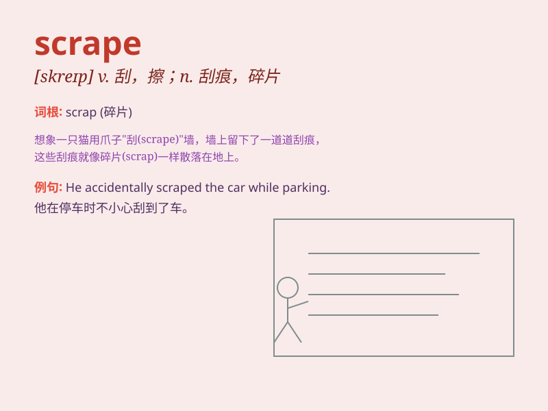

## scrape

**英音:** _[skreɪp]_ **美音:** _[skrep]_

**译义:**
*n.刮,擦,擦痕,刮擦声,困境vi.刮掉,擦掉,刮出刺耳声vt.刮,擦,擦伤,挖成*

### 短语

+ **scrape through:** _勉强通过（考试等）_

+ **scrape together:** _凑集；积攒_

+ **scrape off:** _刮掉；擦掉_

+ **scrape out:** _挖空；挖出_

+ **scrape up:** _费力地获得；勉强凑齐_

### 例句

#### 例句1

> **He scraped his knee when he fell off his bike.**

**中文翻译:** 他从自行车上摔下来时擦伤了膝盖。

**单词释义:** 擦伤

#### 例句2

> **She managed to scrape a pass in the exam.**

**中文翻译:** 她设法在考试中及格了。

**单词释义:** 勉强获得

#### 例句3

> **The car scraped along the wall, leaving a long scratch.**

**中文翻译:** 车子沿着墙壁刮过，留下一道很长的划痕。

**单词释义:** 刮擦

### 背诵小故事

> One day, Tom was walking in the forest and accidentally scraped his
leg on a sharp branch. It hurt a lot, but he learned to be more careful.
The scrape left a mark on his leg as a reminder.

**一天，汤姆在森林里散步，不小心腿被一根尖锐的树枝刮伤了。很疼，但他学会了更小心。这次刮伤在他腿上留下了痕迹作为提醒。**

### 图义

