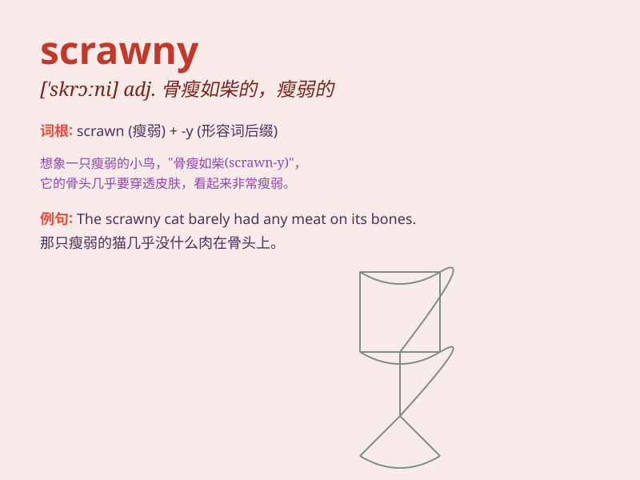

## scrawny

**英音:** _[\'skrɔːnɪ]_ **美音:** _[\'skrɔni]_

**译义:** *adj.瘦脊的,骨瘦如柴的*

### 短语

+ **scrawny chicken:** _瘦骨嶙峋的鸡_

+ **scrawny neck:** _细长的脖子_

+ **scrawny arms:** _瘦弱的胳膊_

+ **scrawny legs:** _干瘪的腿_

+ **scrawny figure:** _瘦长的身影_

### 例句

#### 例句1

> **The scrawny chicken was not suitable for roasting.**

**中文翻译:** 骨瘦如柴的鸡不适合烤。

**单词释义:** 瘦骨嶙峋的；皮包骨头的（形容鸡的状态）

#### 例句2

> **The scrawny cat struggled to find food on the street.**

**中文翻译:** 这只瘦骨嶙峋的猫在街上艰难地寻找食物。

**单词释义:** 瘦弱的（形容猫的身体状况）

#### 例句3

> **He was a scrawny teenager when he first started working out.**

**中文翻译:** 当他第一次开始锻炼时，他还是个骨瘦如柴的少年。

**单词释义:** 瘦长的；骨瘦如柴的（形容少年的身材）

### 背诵小故事

> Once upon a time, there was a little chicken. It was very scrawny
because it didn\'t eat well. Other chickens were big and strong, but it
was thin and weak. We use \'scrawny\' to describe such a thin and weak
state.

**从前，有一只小鸡。它非常瘦弱，因为吃得不好。其他鸡又大又壮，可它却又瘦又弱。我们用'scrawny'来形容这种又瘦又弱的状态。**

### 图义

