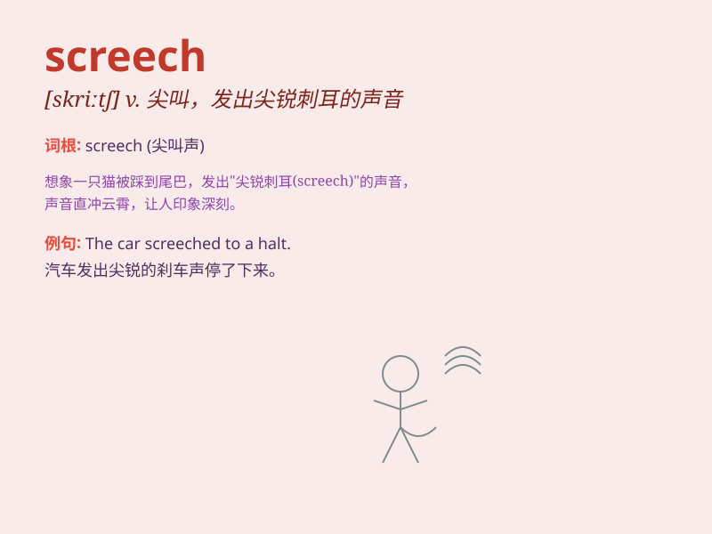

## screech

**英音:** _[skriːtʃ]_ **美音:** _[skritʃ]_

**译义:**
*n.尖声喊叫,尖叫声,急煞车声vt.尖着声音讲或喊vi.发出尖锐的声音,发出恐惧或痛苦的叫喊声*

### 短语

+ **screech to a halt:** _嘎然停止_

+ **screech out:** _尖声喊出_

+ **screech in terror:** _惊恐地尖叫_

+ **screech of brakes:** _刹车的尖叫声_

+ **screech with laughter:** _放声大笑_

### 例句

#### 例句1

> **The car screeched to a halt.**

**中文翻译:** 汽车嘎吱一声停了下来。

**单词释义:** 发出尖锐刺耳的声音

#### 例句2

> **She screeched in terror when she saw the spider.**

**中文翻译:** 当她看到蜘蛛时，她吓得尖叫起来。

**单词释义:** 尖叫

#### 例句3

> **The brakes of the train screeched as it entered the station.**

**中文翻译:** 火车进站时，刹车发出刺耳的声音。

**单词释义:** 发出尖锐刺耳的声音

### 背诵小故事

> One night, I was walking in a quiet alley. Suddenly, a black cat
jumped out and screeched loudly. The sharp and harsh sound made me
tremble. It was such a terrifying screech.

**一天晚上，我走在一条安静的小巷里。突然，一只黑猫跳了出来，并大声尖叫。那尖锐刺耳的声音让我颤抖。那是如此可怕的一声尖叫。**

### 图义

