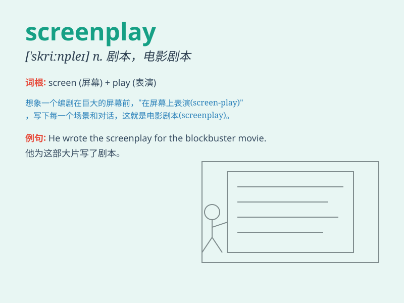

## screenplay

**英音:** _[\'skriːnpleɪ]_ **美音:** _[\'skrin\'ple]_

**译义:** *n.电影剧本*

### 短语

+ **write a screenplay:** _写一个电影剧本_

+ **excellent screenplay:** _出色的电影剧本_

+ **original screenplay:** _原创电影剧本_

+ **adapted screenplay:** _改编的电影剧本_

+ **win an award for screenplay:** _因电影剧本获奖_

### 例句

#### 例句1

> **The screenplay of this movie is highly praised for its
originality.**

**中文翻译:** 这部电影的剧本因其原创性而受到高度赞扬。

**单词释义:** 剧本

#### 例句2

> **She spent years working on the screenplay before it was accepted
by a production company.**

**中文翻译:** 在被制作公司接受之前，她花了数年时间编写剧本。

**单词释义:** 剧本

#### 例句3

> **The director made significant changes to the screenplay to
enhance the story\'s impact.**

**中文翻译:** 导演对剧本进行了重大修改，以增强故事的影响力。

**单词释义:** 剧本

### 背诵小故事

> A young writer dreams of creating a perfect screenplay. One night, a
magical screen appears before him, showing scenes that inspire his
story. He works hard, combining these scenes, and finally finishes the
wonderful screenplay.

**一位年轻的作家梦想创作出一部完美的电影剧本。一天晚上，一块神奇的屏幕出现在他面前，展示出激发他灵感的场景。他努力工作，将这些场景组合起来，最终完成了精彩的电影剧本。**

### 图义

