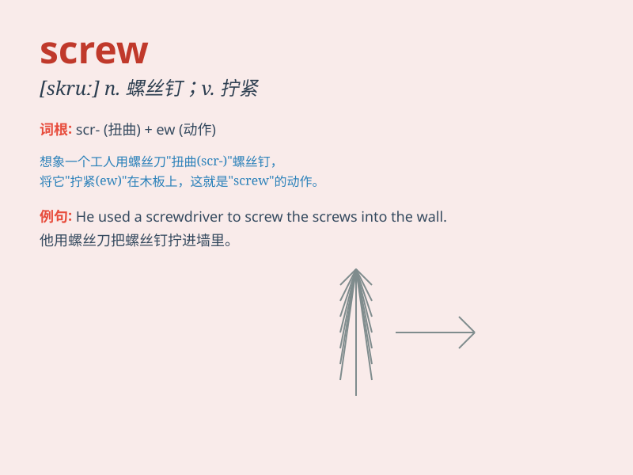

## screw

**英音:** _[skruː]_ **美音:** _[skru]_

**译义:**
*n.螺丝钉,螺旋,螺杆,螺孔,螺旋桨,吝啬鬼vt.调节,旋,加强,压榨,强迫,鼓舞vi.转动,旋,拧*

### 短语

+ **screw up:** _弄糟；搞砸_

+ **put the screw on:** _对...施加压力；强迫_

+ **screw loose:** _精神失常；行为古怪_

+ **screw around:** _鬼混；闲荡_

+ **screw in:** _拧入；旋入_

### 例句

#### 例句1

> **The screw is loose. **

**中文翻译:** 螺丝松动。

**单词释义:** 螺丝

#### 例句2

> **He screwed the lid onto the jar. **

**中文翻译:** 他把盖子拧到罐子上。

**单词释义:** 拧；旋紧

#### 例句3

> **You really screwed up this time. **

**中文翻译:** 这次你真的搞砸了。

**单词释义:** 搞砸；弄糟

### 背诵小故事

> A worker was fixing a machine and needed to tighten a screw. But it
was stuck. He struggled hard and finally managed to screw it in. Now the
machine worked perfectly!

**一名工人正在修理一台机器，需要拧紧一颗螺丝。但它卡住了。他费力地努力，最终成功把螺丝拧进去了。现在机器完美运行！**

### 图义

