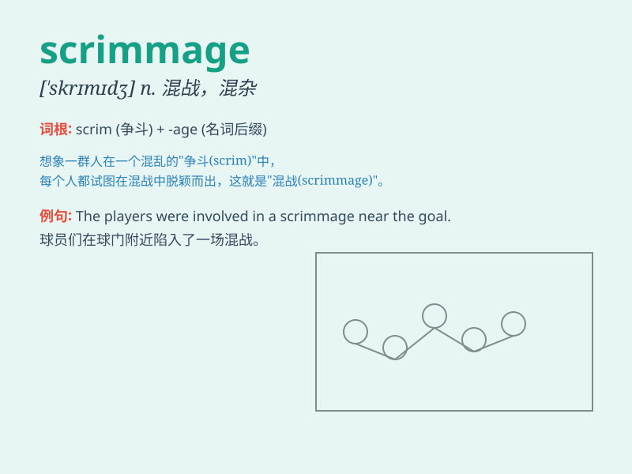

## scrimmage

**英音:** _[ˈskrɪmɪdʒ]_ **美音:** _[ˈskrɪmɪdʒ]_

**译义:** *n.混战,并列争球vt.并列争球vi.混战*

### 短语

+ **football scrimmage:** _足球混战_

+ **scrimmage line:** _争球线_

+ **scrimmage play:** _混战战术_

+ **scrimmage formation:** _混战阵形_

+ **enter the scrimmage:** _加入混战_

### 例句

#### 例句1

> **The football team engaged in a scrimmage before the big game.**

**中文翻译:** 足球队在大赛前进行了一场混战。

**单词释义:** 混战；（美式足球等的）队内分组比赛

#### 例句2

> **The basketball players had a scrimmage to practice their
skills.**

**中文翻译:** 篮球运动员们进行了混战，以练习他们的技术。

**单词释义:** 混战；练习比赛

#### 例句3

> **The scrimmage between the two teams was intense and
competitive.**

**中文翻译:** 两队之间的混战非常激烈，竞争激烈。

**单词释义:** 混战；激烈的比赛

### 背诵小故事

> In a football game, the teams had a scrimmage before the official
start. Players were running, pushing, and fighting for the ball. It was
a chaotic but exciting scrimmage that prepared them for the real match.

**在一场足球比赛中，球队在正式开始前进行了一场混战。球员们奔跑、推搡、争抢球。这是一场混乱但令人兴奋的混战，为真正的比赛做准备。**

### 图义

