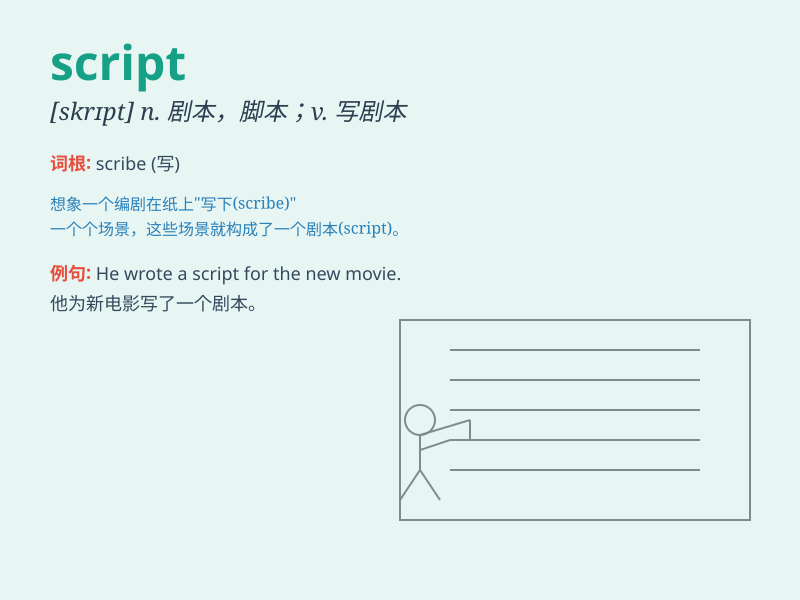

## script

**英音:** _[skrɪpt]_ **美音:** _[skrɪpt]_

**译义:** *n.手稿,手迹,剧本,考生的笔试卷,原本*

### 短语

+ **movie script:** _电影剧本_

+ **script writing:** _剧本创作_

+ **stage script:** _舞台剧剧本_

+ **script editor:** _剧本编辑_

+ **original script:** _原创剧本_

### 例句

#### 例句1

> **The script for the play was very well-written.**

**中文翻译:** 该剧的剧本写得非常好。

**单词释义:** 剧本

#### 例句2

> **She spent hours writing the script for her short film.**

**中文翻译:** 她花了几个小时为她的短片写剧本。

**单词释义:** 脚本

#### 例句3

> **The doctor\'s handwriting was so bad that it looked like a
script.**

**中文翻译:** 医生的字迹太潦草了，看起来就像是手稿。

**单词释义:** 手写体

### 背诵小故事

>
想象一下，一位古代的学者在烛光下认真地用羽毛笔在羊皮纸上书写，他所留下的这些文字就像是\'script\'。它是剧本、笔迹的意思，就如同学者写下的珍贵记录。

**想象一位古代学者书写的场景来辅助记忆【script】这个单词，其意思是剧本、笔迹**

### 图义

