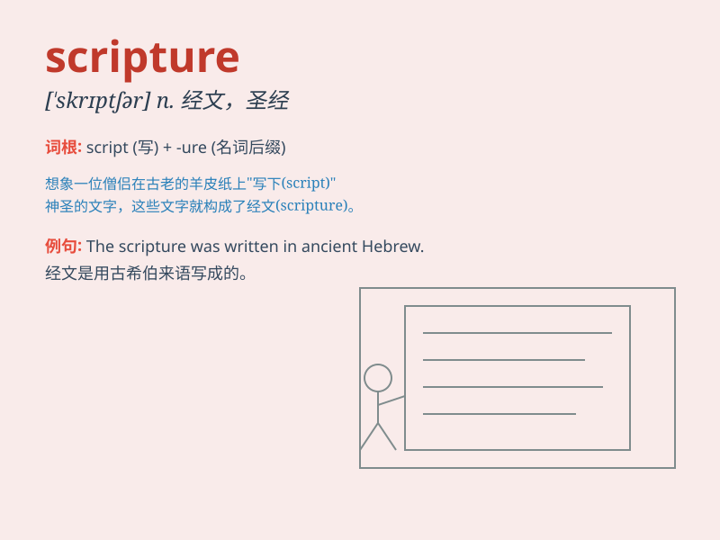

## scripture

**英音:** _[\'skrɪptʃə]_ **美音:** _[\'skrɪptʃɚ]_

**译义:** *n.手稿,文件,[Scripture] 基督教(圣经),经文*

### 短语

+ **Holy Scripture:** _圣经_

+ **scripture reader:** _读经者_

+ **scripture study:** _经文研究_

+ **scripture class:** _圣经课程_

+ **interpret scripture:** _解释经文_

### 例句

#### 例句1

> **The study of scripture is an important part of religious
education.**

**中文翻译:** 经文研究是宗教教育的重要组成部分。

**单词释义:** 经文

#### 例句2

> **He spent hours poring over ancient scriptures.**

**中文翻译:** 他花了几个小时研读古代经文。

**单词释义:** 经文

#### 例句3

> **The teachings of this religion are based on its scriptures.**

**中文翻译:** 该宗教的教义基于其经文。

**单词释义:** 经文

### 背诵小故事

>
想象一下，一位古老的学者在烛光下认真书写（script）宗教经文。他的每一笔每一划都充满敬畏，这些被写下的神圣文字就是\'scripture\'。

**想象一位学者书写宗教经文来辅助记忆\'scripture\'这个单词，意思是（宗教的）经典著作；经文**

### 图义

