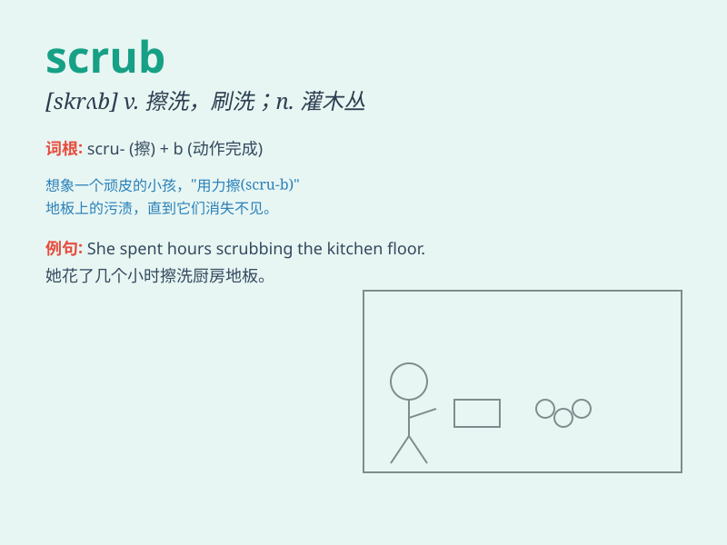

## scrub

**英音:** _[skrʌb]_ **美音:** _[skrʌb]_

**译义:**
*v.洗擦,擦净,使(气体)净化,擦洗n.洗擦,擦净,擦洗者,矮树,灌木,丛林地,矮小的人(或动物)adj.次等的,矮小的,临时凑合的*

### 短语

+ **scrub off:** _擦掉，抹去_

+ **scrub out:** _擦掉，擦去_

+ **scrub up:** _（为手术等）彻底洗手消毒；梳洗整洁_

+ **scrub brush:** _硬毛刷_

+ **scrub land:** _灌木丛林地_

### 例句

#### 例句1

> **She scrubbed the kitchen floor until it was spotless.**

**中文翻译:** 她把厨房的地板擦得一尘不染。

**单词释义:** 擦洗；用力刷洗

#### 例句2

> **The doctor told him to scrub his hands thoroughly before the
operation.**

**中文翻译:** 医生告诉他手术前要彻底擦洗双手。

**单词释义:** 用力擦洗；刷洗

#### 例句3

> **We had to scrub our plans for the picnic because of the bad
weather.**

**中文翻译:** 由于天气不好，我们不得不取消野餐计划。

**单词释义:** 取消；撤销

### 背诵小故事

> A little monkey wanted to clean the dirty tree house. It used a brush
to scrub hard. After a while, the house became clean. The monkey was
happy as it successfully did the scrubbing.

**一只小猴子想打扫脏兮兮的树屋。它用刷子用力擦洗。过了一会儿，房子变干净了。猴子很高兴，因为它成功地完成了擦洗工作。**

### 图义

