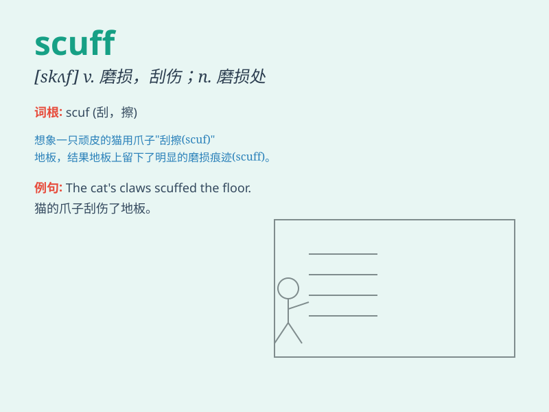

## scuff

**英音:** _[skʌf]_ **美音:** _[skʌf]_

**译义:**
*vi.拖足而行,磨损vt.以足擦地,践踏,使磨损n.拖着脚走,磨损之处*

### 短语

+ **scuff mark:** _磨损痕迹；擦痕_

+ **scuff up:** _磨损；弄伤表面_

+ **scuff the floor:** _磨损地板_

+ **scuff one\'s shoes:** _磨损某人的鞋子_

+ **scuff along:** _拖着脚走；慢吞吞地走_

### 例句

#### 例句1

> **She scuffed her shoes on the pavement.**

**中文翻译:** 她的鞋子在人行道上磨损了。

**单词释义:** 磨损；擦伤

#### 例句2

> **The chair legs scuffed the floor.**

**中文翻译:** 椅子腿磨损了地板。

**单词释义:** 擦伤；磨损

#### 例句3

> **He scuffed his feet as he walked, looking dejected.**

**中文翻译:** 他走路时脚都磨破了，看上去很沮丧。

**单词释义:** 拖着（脚）走

### 背诵小故事

> One day, Tom was walking in the park. He accidentally scuffed his new
shoes on a rough stone. He was very sad. But then he learned to be more
careful next time.

**一天，汤姆在公园散步。他不小心在一块粗糙的石头上磨损了他的新鞋。他非常伤心。但随后他学会了下次要更小心。**

### 图义

