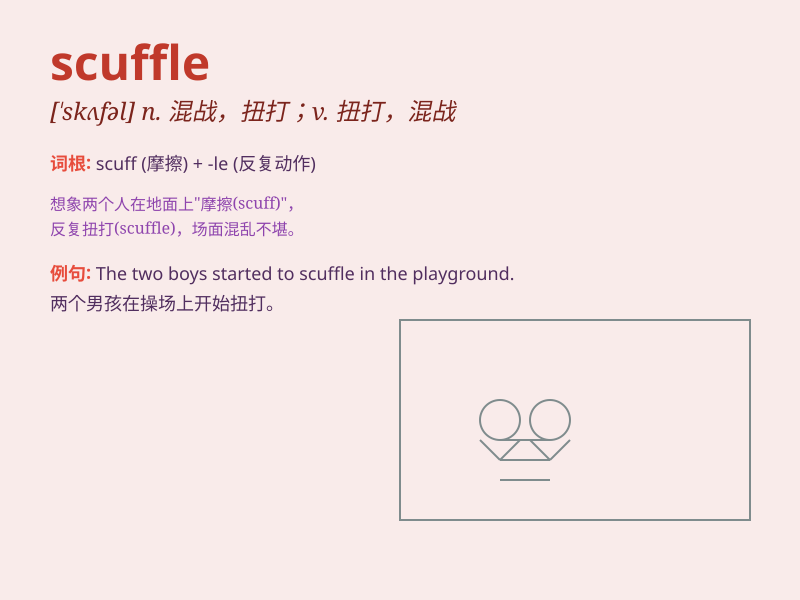

## scuffle

**英音:** _[\'skʌf(ə)l]_ **美音:** _[\'skʌfl]_

**译义:** *v.混战n.混战*

### 短语

+ **scuffle with:** _与\...扭打；与\...争斗_

+ **get into a scuffle:** _陷入扭打；卷入争斗_

+ **a scuffle broke out:** _一场扭打爆发了_

+ **end in a scuffle:** _以扭打结束_

+ **scuffle over something:** _为某事扭打_

### 例句

#### 例句1

> **There was a scuffle outside the bar last night.**

**中文翻译:** 昨晚，酒吧外发生了一场扭打。

**单词释义:** 扭打；混战

#### 例句2

> **The two boys got into a scuffle over the toy.**

**中文翻译:** 两个男孩为了玩具发生了扭打。

**单词释义:** （因争抢而发生的）扭打

#### 例句3

> **The police broke up the scuffle in the street.**

**中文翻译:** 警察驱散了街上的扭打。

**单词释义:** 混战；打斗

### 背诵小故事

> A thief tried to steal in a market. The shopkeeper caught him and a
scuffle happened. People gathered around. Finally, the thief was caught.
Remember, scuffle means a short and confused fight.

**一个小偷试图在市场行窃。店主抓住了他，随后发生了一场扭打。人们围了过来。最后，小偷被抓住了。记住，scuffle
意思是短暂而混乱的扭打。**

### 图义

