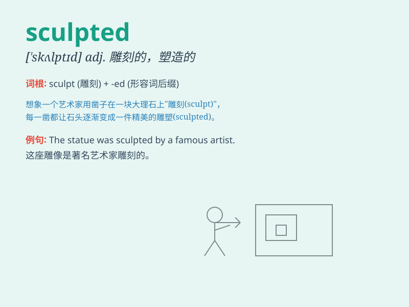

## sculpted

**英音:** _[ˈscʌlptɪd]_ **美音:** _[ˈskʌlptɪd]_

**译义:** *adj.雕塑的；雕刻的（表示某物被雕刻或雕塑过）*

### 短语

+ **sculpted figure:** _雕塑般的身材_

+ **sculpted face:** _雕刻般的面容_

+ **sculpted masterpiece:** _雕刻杰作_

+ **sculpted form:** _雕刻的形状_

+ **sculpted beauty:** _雕琢之美_

### 例句

#### 例句1

> **The artist sculpted a beautiful statue of a woman.**

**中文翻译:** 这位艺术家雕刻了一座美丽的女子雕像。

**单词释义:** 雕刻

#### 例句2

> **The mountains were sculpted by wind and water over millions of
years.**

**中文翻译:** 这些山脉经过数百万年的风蚀和水蚀而成形。

**单词释义:** 塑造；使成形

#### 例句3

> **Her face was sculpted with delicate features.**

**中文翻译:** 她的脸有着精致的轮廓。

**单词释义:** 使具有某种轮廓

### 背诵小故事

> A talented artist spent days sculpting a beautiful statue. He
carefully chiseled and shaped the stone until it was perfectly sculpted.
The final work was a masterpiece that amazed everyone.

**一位才华横溢的艺术家花了好几天时间雕刻一座美丽的雕像。他仔细地凿刻和塑造石头，直到它被完美地雕刻成型。最终的作品是一个令所有人惊叹的杰作。**

### 图义

