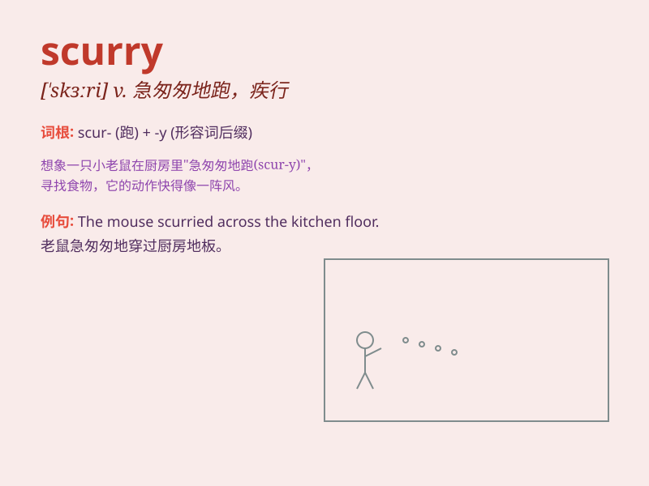

## scurry

**英音:** _[\'skʌrɪ]_ **美音:** _[\'skɝi]_

**译义:**
*vi.急赶,急跑,急转,以轻快而交替的步子走动n.急赶,急跑,急转*

### 短语

+ **scurry away:** _匆匆跑开_

+ **scurry about:** _到处乱跑_

+ **scurry off:** _急忙离开_

+ **scurry through:** _匆忙完成_

+ **scurry along:** _匆匆前行_

### 例句

#### 例句1

> **The mice scurried across the floor when they heard a noise.**

**中文翻译:** 当老鼠听到声音时，它们就在地板上乱窜。

**单词释义:** 急匆匆地跑

#### 例句2

> **She scurried to catch the bus.**

**中文翻译:** 她急忙去赶公共汽车。

**单词释义:** 匆忙跑

#### 例句3

> **The children scurried around the playground.**

**中文翻译:** 孩子们在操场上跑来跑去。

**单词释义:** 到处乱跑

### 背诵小故事

> One day, a little mouse was in a big room. Suddenly, it heard a loud
noise. It was scared and started to scurry around, running quickly to
find a safe place.

**一天，一只小老鼠在一个大房间里。突然，它听到一声巨响。它很害怕，开始急匆匆地到处跑，快速跑着去找一个安全的地方。**

### 图义

