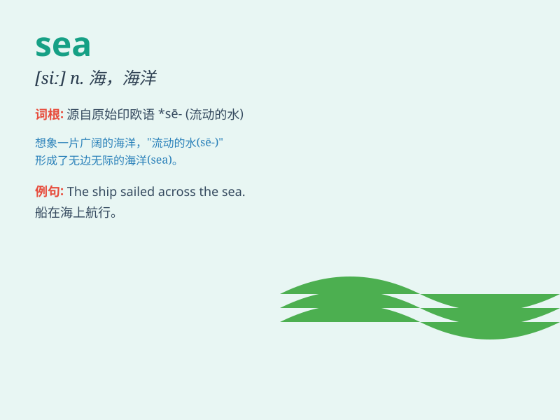

## sea

**英音:** _[siː]_ **美音:** _[si]_

**译义:** *n.海洋,大浪,大量,许多*

### 短语

+ **at sea:** _在海上；茫然；困惑_

+ **by sea:** _乘船；由海路_

+ **on the sea:** _在海上_

+ **sea level:** _海平面_

+ **sea food:** _海鲜_

### 例句

#### 例句1

> **The sea is very calm today.**

**中文翻译:** 今天的海面非常平静。

**单词释义:** 大海

#### 例句2

> **We went swimming in the sea.**

**中文翻译:** 我们去海里游泳了。

**单词释义:** 海；海洋

#### 例句3

> **The ship is sailing on the sea.**

**中文翻译:** 船正在海上航行。

**单词释义:** 海洋

### 背诵小故事

> A little fish was lost in the vast sea. It swam and swam, looking for
its friends. Finally, it found them in a beautiful coral reef. The sea
is so big and full of wonders.

**一条小鱼在广阔的大海中迷路了。它游啊游，寻找它的朋友。最后，它在一处美丽的珊瑚礁找到了它们。大海是如此广阔，充满了奇迹。**

### 图义

