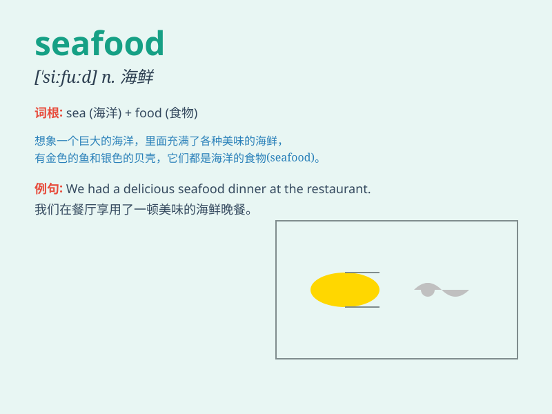

## seafood

**英音:** _[\'siːfuːd]_ **美音:** _[\'sifud]_

**译义:** *n.海产食品,海味*

### 短语

+ **seafood dish:** _海鲜菜肴_

+ **seafood market:** _海鲜市场_

+ **seafood restaurant:** _海鲜餐厅_

+ **fresh seafood:** _新鲜的海鲜_

+ **cooked seafood:** _烹饪好的海鲜_

### 例句

#### 例句1

> **I love eating seafood, especially prawns and crabs.**

**中文翻译:** 我喜欢吃海鲜，尤其是虾和螃蟹。

**单词释义:** 海鲜

#### 例句2

> **The restaurant is famous for its fresh seafood.**

**中文翻译:** 餐厅以其新鲜的海鲜而闻名。

**单词释义:** 海鲜

#### 例句3

> **We bought some seafood at the market for dinner.**

**中文翻译:** 晚餐我们在市场买了一些海鲜。

**单词释义:** 海鲜

### 背诵小故事

> One day, a little boy went to the market with his parents. He saw
many kinds of seafood, like crabs, shrimps and fish. He was so excited
and asked his parents to buy some. That\'s how he learned the
word\'seafood\'.

**有一天，一个小男孩和他的父母去市场。他看到了很多种海鲜，像螃蟹、虾和鱼。他非常兴奋，并让父母买一些。就这样他记住了"seafood"这个单词。**

### 图义

