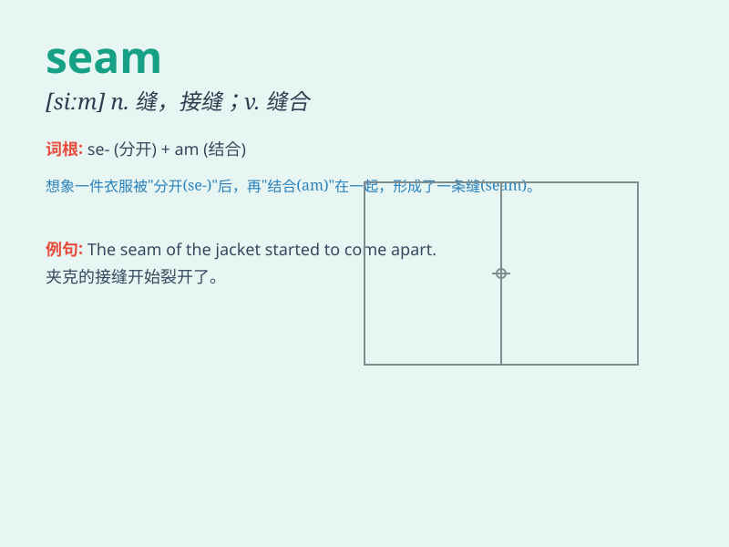

## seam

**英音:** _[siːm]_ **美音:** _[sim]_

**译义:**
*n.接缝,线缝,缝合线,衔接口,伤疤,层vt.缝合,接合,焊合,使留下伤痕vi.裂开,发生裂痕*

### 短语

+ **seam allowance:** _缝份；缝头_

+ **coal seam:** _煤层_

+ **seam stress:** _焊缝应力_

+ **seam line:** _缝线；接缝线_

+ **seam welding:** _缝焊_

### 例句

#### 例句1

> **The seam of the dress was coming apart.**

**中文翻译:** 这件连衣裙的接缝开了。

**单词释义:** 接缝；缝

#### 例句2

> **There was a seam of coal running through the mountain.**

**中文翻译:** 山里有一条煤层。

**单词释义:** 煤层

#### 例句3

> **The baseball was stitched along the seam.**

**中文翻译:** 这个棒球沿着缝线被缝合。

**单词释义:** 缝线

### 背诵小故事

> A tailor was working hard to stitch a seam on a beautiful dress. The
seam had to be perfect to make the dress look flawless. It was a crucial
part that held the fabric together.

**一位裁缝正在努力缝合一条裙子上的缝。这条缝必须完美，才能让裙子看起来无瑕疵。它是将布料连接在一起的关键部分。**

### 图义

