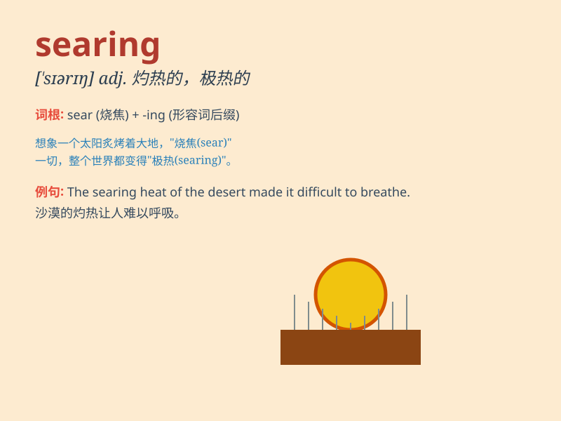

## searing

**英音:** _[ˈsɪərɪŋ]_ **美音:** _[ˈsɪrɪŋ]_

**译义:** *adj.灼热的；剧烈的；刺痛的；极热的*

### 短语

+ **searing heat:** _灼热；酷热_

+ **searing pain:** _剧痛；灼痛_

+ **searing criticism:** _严厉的批评；尖锐的批评_

+ **searing look:** _灼热的目光；严厉的眼神_

+ **searing experience:** _痛苦的经历；煎熬的经历_

### 例句

#### 例句1

> **The searing heat of the desert made it unbearable to walk during
the day.**

**中文翻译:** 沙漠的灼热高温使得白天行走难以忍受。

**单词释义:** 灼热的；强烈的

#### 例句2

> **She gave him a searing look of accusation.**

**中文翻译:** 她给了他一个充满指责的严厉目光。

**单词释义:** 严厉的；强烈的

#### 例句3

> **The searing pain in his leg made him cry out.**

**中文翻译:** 他腿上的剧痛使他叫了出来。

**单词释义:** 剧烈的；刺痛的

### 背诵小故事

> A brave firefighter was in the searing heat of a huge fire. The
flames were so intense that it felt like his skin was burning. But he
didn\'t give up and finally put out the fire. \'Searing\' means
extremely hot or intense.

**一位勇敢的消防员身处一场大火的灼热之中。火焰是如此强烈，感觉他的皮肤都在燃烧。但他没有放弃，最终扑灭了大火。'searing'意思是极其炎热或强烈的。**

### 图义

