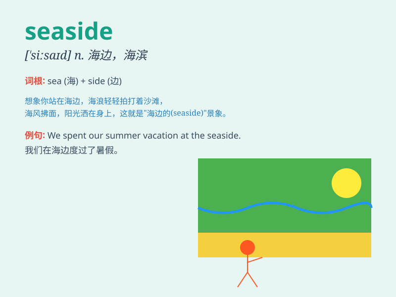

## seaside

**英音:** _[\'siːsaɪd]_ **美音:** _[\'sisaɪd]_

**译义:** *n.海滨(胜地),滨海城镇,海边adj.海边的,海滨的*

### 短语

+ **seaside resort:** _海滨度假胜地_

+ **seaside town:** _海滨城镇_

+ **seaside walk:** _海滨漫步_

+ **seaside picnic:** _海滨野餐_

+ **seaside view:** _海滨景色_

### 例句

#### 例句1

> **We spent a lovely weekend at the seaside.**

**中文翻译:** 我们在海边度过了一个愉快的周末。

**单词释义:** 海边

#### 例句2

> **The children were building sandcastles on the seaside.**

**中文翻译:** 孩子们正在海边堆沙堡。

**单词释义:** 海边

#### 例句3

> **I love to take walks along the seaside in the evening.**

**中文翻译:** 我喜欢在晚上沿着海边散步。

**单词释义:** 海边

### 背诵小故事

> One sunny day, a little girl named Lily went to the seaside. She saw
the blue sea, golden sand, and heard the waves crashing. She had a
wonderful time playing and collecting shells there. The seaside became
her favorite place.

**在一个阳光明媚的日子，一个叫莉莉的小女孩去了海边。她看到蓝色的大海、金色的沙滩，还听到海浪拍打的声音。她在那里玩得很开心，还捡了贝壳。海边成了她最喜欢的地方。**

### 图义

