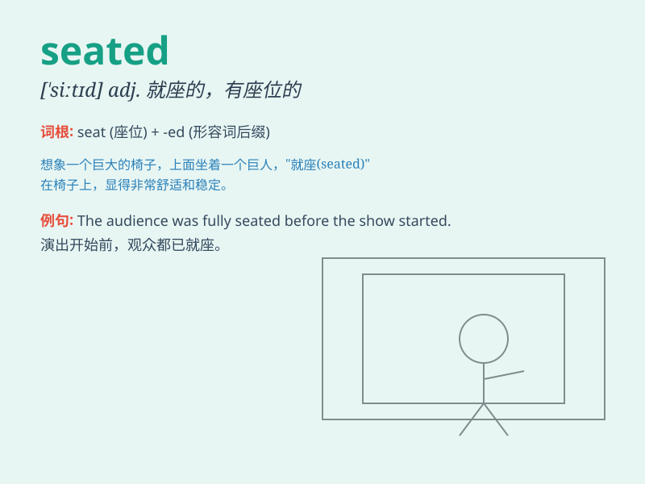

## seated

**英音:** _[ˈsiːtɪd]_ **美音:** _[ˈsiːtɪd]_

**译义:** *adj.就座的,固定的*

### 短语

+ **be seated:** _就座；坐下_

+ **remain seated:** _保持坐着_

+ **seated position:** _坐着的姿势_

+ **comfortably seated:** _舒适地坐着_

+ **properly seated:** _正确地坐着_

### 例句

#### 例句1

> **She was seated at the desk, writing a letter.**

**中文翻译:** 她坐在书桌前，正在写信。

**单词释义:** 坐着的

#### 例句2

> **The audience was seated in the auditorium.**

**中文翻译:** 观众们在礼堂里就座。

**单词释义:** 就座的

#### 例句3

> **He remained seated throughout the meeting.**

**中文翻译:** 整个会议期间他都坐着没动。

**单词释义:** 坐着

### 背诵小故事

>
想象一下，有个盛大的音乐会，人们都在找座位。小明终于找到了自己的位置并坐了下来，这时他就是\'seated\'。大家都\'seated\'后，音乐会就开始了。

**想象在音乐会中，小明找到座位坐下，大家都坐好的情景来记住\'seated\'表示就座的、坐下的意思**

### 图义

