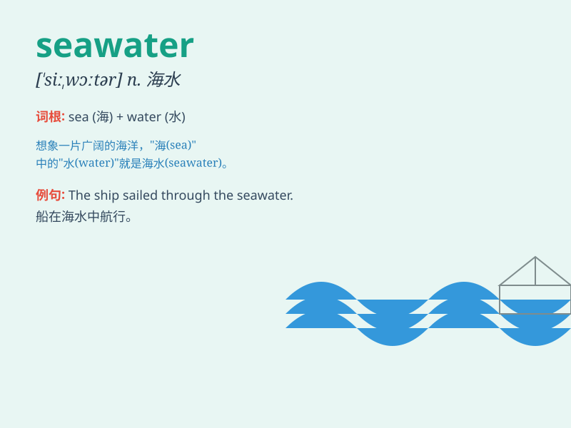

## seawater

**英音:** _[ˈsiːˌwɔːtə]_ **美音:** _[ˈsiˌwɑtər]_

**译义:** *n.海水*

### 短语

+ **seawater desalination:** _海水淡化_

+ **seawater intrusion:** _海水入侵_

+ **seawater quality:** _海水质量_

+ **seawater pump:** _海水泵_

+ **seawater temperature:** _海水温度_

### 例句

#### 例句1

> **The fish swim freely in the seawater.**

**中文翻译:** 鱼儿在海水中自由地游动。

**单词释义:** 海水

#### 例句2

> **Seawater is very salty.**

**中文翻译:** 海水非常咸。

**单词释义:** 海水

#### 例句3

> **The scientist is studying the composition of seawater.**

**中文翻译:** 这位科学家正在研究海水的成分。

**单词释义:** 海水

### 背诵小故事

> One day, a little fish was swimming happily in the seawater. It saw
beautiful corals and colorful shells. The seawater was so clear and
blue, giving the little fish a wonderful home.

**有一天，一条小鱼在海水里欢快地游着。它看到了美丽的珊瑚和五颜六色的贝壳。海水是如此清澈湛蓝，给小鱼提供了一个美妙的家。**

### 图义

